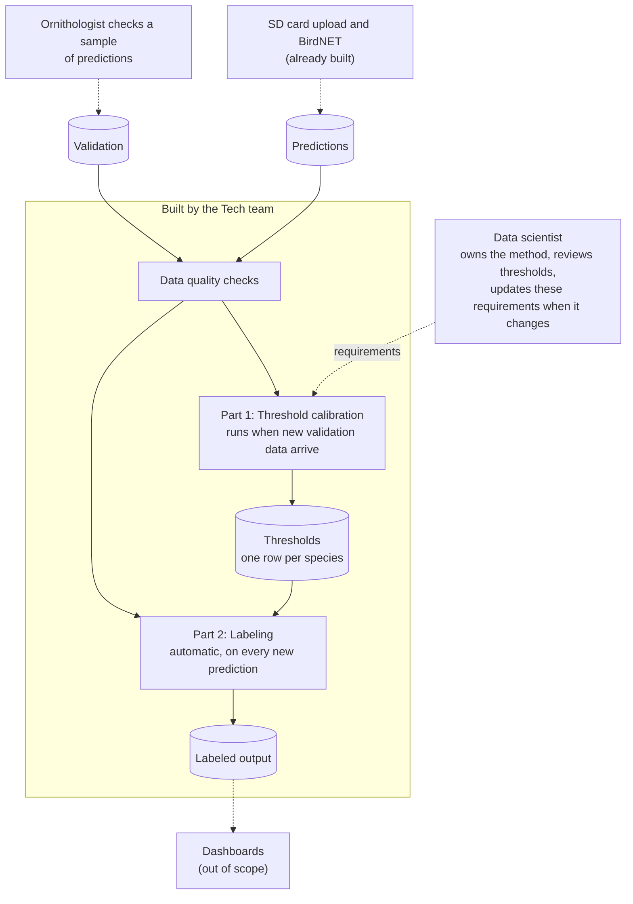

# Tech requirements: BirdNET observation pipeline

Requirements for BirdNET data pipeline to automate and manage data processing, analysis, and output for downstream
use cases.

## 1. Context and Purpose

BirdNET stores a **prediction** (a species and a confidence score) for every 3-second segment of audio. 
BirdNET's machine learning classifier assigns a confidence score to each segment as to whether or not one or more
labeled classes are vocalizing in that segment.
An ornithologist checks a sample of predictions and these checks are stored in the **validation** data.
From that sample, a **threshold** is calculated for each species: the lowest score at which a prediction 
has at least a 99% chance of being correct. A prediction at or above its species' threshold is an 
**observation**. Dashboards use only observations.

## 2. Pipeline Overview

The scope of this data pipeline starts with taking the *prediction* and *validation* data, automates checking the data for
quality control, automates the analysis to identify observations in the data, automates the creation of the observation,
dataset, and finally, stores this data so that can be used for downstream reporting and dashboarding.

 - Step 1. **Data Quality Control** 
Run the data quality checks defined in section 5. 
QC on Predictions run every time new predictions are stored.
QC on Validation and across the two tables run every time thresholds are calculated.

 - Step 2. **Threshold Calibration**
*Overview:* For each species in Validation, calculate a threshold and a support level
and write them to the Thresholds table. The method is specified in section 6. It 
runs when new validation data arrive, and a data scientist reviews the result before
it is used. The reasons for each analytical choice are in
[bird_analysis.md, section 2](bird_analysis.md#2-modelling-from-confidence-scores-to-species-thresholds).

 - Step 3. **Thresholds table.** 
 One row per species: species, threshold (empty if none), support level, method, and the date calculated.
 Keep earlier versions following NS version control protocol.
 
 - Step 4. **Labeling (Part 2).** 
 Create a new data table where for each prediction, set `observation` to `common_name` if 
 its species has a threshold and `confidence` is at or above it. 
 Otherwise leave it empty. When evaluating if its species has a threshold and `confidence`
 is at or above it, use the original score, not the clipped one.
 
 - Step 5. **Labeled output.** Create the output table: `Labeled` as the Predictions table plus the `observation` column,
 with the same rows as the input.

 - Step 6. **Output QC.** Before publishing: QC that the row count is unchanged, 
 the key is still unique, every observation is at or above its species' threshold, 
 every prediction at or above its threshold is labeled, each observation names its 
 own species, and no species without a threshold has an observation. Any failure is a STOP.
 
 - Step 7. **Publishing output.** Publish nothing until all checks have run. Record every check result: 
 check, table, status, rows affected, and time run in a run log. 
 
 - Step 8. **Re-runs.** Run labeling on every new upload. Run calibration again when new validation 
 data arrive or conditions change (a new BirdNET version, new recording hardware, a new region or season).

## 3. Inputs

The input data are described using the column names in the files 
`birdnet_predictions.csv` and `validation_results.csv`. 
Only the columns the pipeline requires are listed.

**Predictions** (one row per prediction). Key: `begin_path` + `begin_time_s` + `common_name`.

| Column | Type | Rule |
|---|---|---|
| `begin_path` | text | Recording the prediction came from. Not empty |
| `begin_time_s` | integer | Segment start, in seconds. 0 or more |
| `common_name` | text | Species. Not empty |
| `confidence` | number | Greater than 0 and at most 1. Never rounded |
| `folder` | text | Recorder. Not empty |

**Validation** (one row per checked prediction). Key: `filename`.

| Column | Type | Rule |
|---|---|---|
| `filename` | text | The checked clip, in the form `<confidence>_<n>_<recorder>_<YYYYMMDD>_<HHMMSS>.wav`. Unique. Not empty |
| `commonName` | text | Species. Not empty |
| `vBirdNET` | text | BirdNET version, for example `v2.4` |
| `confidence` | number | Greater than 0 and at most 1 |
| `outcome` | integer | 0 or 1. `1` means the ornithologist judged the prediction correct |

## 4. Data quality checks

Each check gives a status:

- **STOP** (halts the run and publishes nothing), 

- **FLAG** (continues; record in log) or 

- **INFO** (continues; recorded). 

The sample data give no STOP. The full rules and the results on the sample are in
[bird_analysis.md, section 1](bird_analysis.md#1-data-exploration-and-summaries).

| Table | Check | Status if it fails |
|---|---|---|
| Predictions | No missing values | **STOP** |
| Predictions | `confidence` is greater than 0 and at most 1 | **STOP** |
| Predictions | Key (`begin_path`, `begin_time_s`, `common_name`) is unique | **STOP** |
| Predictions | Species and species code match one-to-one | **FLAG** |
| Predictions | No stray spaces in text columns | **FLAG** |
| Predictions | No score of exactly 1.0 | **FLAG** |
| Predictions | Segments are 3 seconds long | **FLAG** |
| Predictions | No overlapping segments for the same species in a recording | **FLAG** |
| Predictions | Recording path has the expected form | **FLAG** |
| Predictions | Recorder matches the recorder in the path | **FLAG** |
| Predictions | Segments end within an hour | **INFO** |
| Predictions | One species per segment | **INFO** |
| Validation | No missing values | **STOP** |
| Validation | `outcome` is 0 or 1 | **STOP** |
| Validation | `filename` is unique | **STOP** |
| Validation | Species names match one-to-one | **FLAG** |
| Validation | No stray spaces in text columns | **FLAG** |
| Validation | `filename` has the expected form | **FLAG** |
| Validation | `confidence` matches the score in `filename` | **FLAG** |
| Validation | One BirdNET version | **FLAG** |
| Validation | No score of exactly 1.0 | **FLAG** |
| Validation | Both outcomes present for every species | **FLAG** |
| Validation | No species is nearly one-sided | **INFO** |
| Both tables | Same species in both tables | **FLAG** |
| Both tables | Same date range in both tables | **FLAG** |
| Both tables | Every validated recorder is in Predictions | **FLAG** |
| Both tables | Every recorder in Predictions has validation clips | **FLAG** |
| Both tables | Validation recordings start on the hour | **FLAG** |
| Both tables | Validation rows can be traced to a prediction | **FLAG** |
| Both tables | Validation scores are representative of the predictions | **INFO** |

## 6. Calibration

**Turning a fitted line into a threshold.** Applied to each species in order:

| Rule | Result | Support level |
|---|---|---|
| The fitted probability is already 99% or more at the lowest validated score | Threshold is that lowest validated score, so every prediction qualifies | Weak |
| Otherwise the line never reaches 99% within the validated scores, or its slope is not positive | No threshold, so no observations for that species | No threshold |
| Otherwise | Threshold is the score where the line reaches 99% | Solid if the 95% interval for the slope excludes 0, otherwise Weakly identified |

## 6. Reference values

The build should reproduce these on the sample data.

| Species | Threshold | Support level | Observations |
|---|---|---|---|
| Abyssinian Nightjar | 0.667 | Solid | 3,147 of 10,187 |
| African Black-headed Oriole | 0.100 (all predictions) | Weak | 18,054 of 18,054 |
| Three-banded Plover | 0.817 | Weakly identified | 114 of 1,015 |
| Red-billed Firefinch | none | No threshold | 0 of 235 |

In total, 21,315 of 29,491 predictions are observations. Why each threshold was chosen is explained in [bird_analysis.md, section 2](bird_analysis.md#2-modelling-from-confidence-scores-to-species-thresholds), and the decision to use the point estimates in [section 3.3](bird_analysis.md#33-decision-operate-at-the-point-estimates).

## 7. Open questions for Natural State

1. **Validation records.** Can they include `begin_path` and `begin_time_s` for each checked clip? Today a clip can only be traced to a prediction by an ambiguous match (see [section 1.3](bird_analysis.md#13-cross-file-checks)).
2. **BirdNET version.** Can Predictions include `vBirdNET`? Validation has it, and thresholds are only valid for the version they were calibrated on.
3. **Off-the-hour recordings.** 288 of 551 validation clips come from recordings that are not in Predictions. Where did they come from?
4. **Oriole.** Every Oriole prediction is labeled an observation, but the data cannot show that it reaches 99%. Label all, label none, or hold until more are checked?
5. **Unmatched validation rows.** They were kept and reported in the sample. Should production stop on them, or continue?
6. **Species identifier.** Common name (as in the sample) or a species code?
7. **Changed thresholds.** When thresholds change, should earlier predictions be relabeled?
8. **Minimum validation.** How many checked clips does a species need before its threshold is trusted? The analysis set no minimum.
9. **Sensitivity.** The analysis assumed BirdNET's default sensitivity of 1. Is that what Natural State used?
10. **Proposed rules.** The Firth rule (fewer than 10 clips) and the support levels in section 4 are proposals that match the analysis results. Please confirm them.
