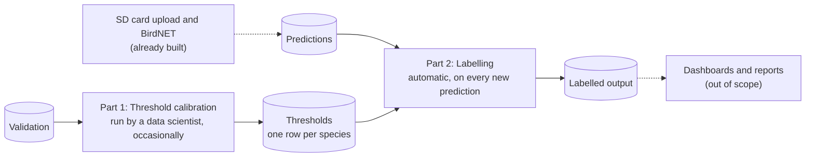
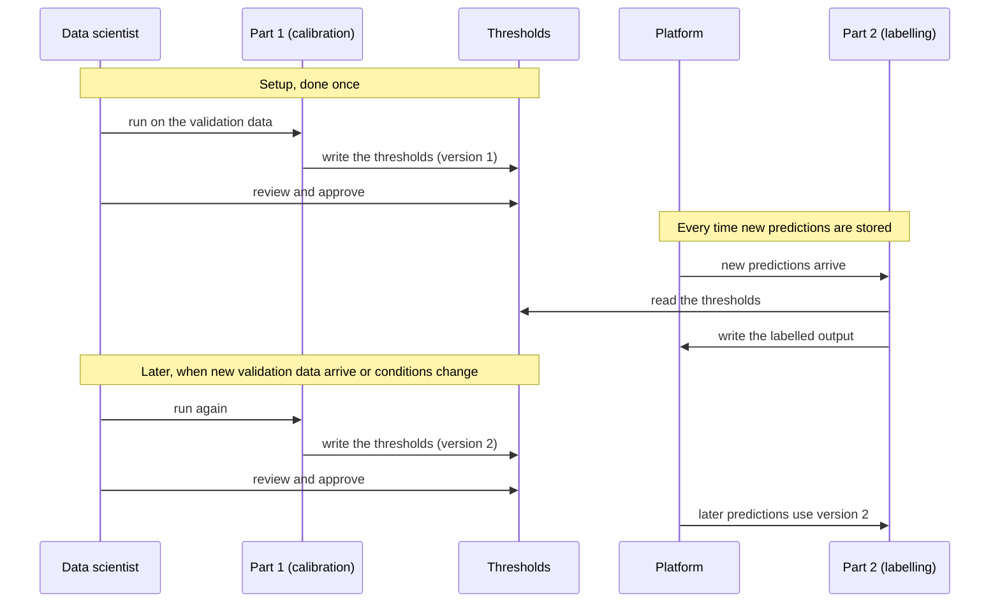

# Tech requirements: turning BirdNET predictions into observations

What the Tech team needs to build, run, and test the post- BirdNET ML pipeline for passive acoustic monitoring data on the Natural State Analytics platform.

## 1. Purpose

Projects record bird calls with passive acoustic monitoring devices. Once the recordings are uploaded, BirdNET analyses the audio in 3-second segments and stores a **prediction** for each one: a species, and a confidence score between 0 and 1. A single upload produces a very large number of predictions. In the sample data, 29,491 predictions came from 1,696 recordings.

Two problems stop these predictions from being used directly:

- **There are too many to check by a subject matter expert.** An ornithologist can only validate a small sample.
- **The confidence score is not a probability.** A score of 0.80 does not mean "80% likely to be correct", and the same score means different things for different species (Wood & Kahl, 2024).

This pipeline decides which predictions are reliable enough to be treated as **observations**: records that a species was present, held to a quality standard of at least a 99% probability of being correct. It does this separately for each species, using a **threshold** (a minimum confidence score) calculated for that species from a sample of predictions that an ornithologist has already checked, called the **validation** data.

**What the pipeline produces.** For every prediction, an `observation` value: the species name if the prediction meets the standard, and empty if it does not. Dashboards and project reports then use only the labelled observations.

**Scope**

| | |
|---|---|
| **Starts from** | BirdNET predictions already stored on the platform |
| **Ends with** | Every prediction labelled as an observation or left unlabelled |
| **Not covered here** | SD card upload; running BirdNET; dashboards and reports; how ornithologists carry out validation (this document covers only the format their results must arrive in) |

## 2. Overview

The pipeline has two parts that are run sequentially and are joined by a **thresholds** table with one value for each species. **Part 1, threshold calibration,** works out a threshold for each species from the validation data. **Part 2, labelling,** compares every prediction's confidence score with its species' threshold and labels the ones that meet the threshold and can thus be labeled as observations. Calibration has to run first, because labeling needs the thresholds to exist.

### 2.1 The two parts

| | Part 1: Threshold calibration | Part 2: Labeling |
|---|---|---|
| **What it does** | Works out the minimum confidence score for each species at which a prediction counts as an observation | Labels each prediction as an observation if its score reaches its species' threshold |
| **Reads** | Validation | Predictions and thresholds |
| **Writes** | Thresholds | Labeled output |
| **When it runs** | At setup, then only when new validation data arrive or conditions change | Automatically, whenever new predictions are stored |
| **Run by** | A data scientist, who reviews the result before it is used downstream| The platform, with no manual step |

### 2.2 The four data tables

| Name | What it is | Where it comes from | Used by |
|---|---|---|---|
| **Predictions** | BirdNET's output: one row per prediction, giving the species, the confidence score, and which recording and which 3-second segment it came from | The existing ML pipeline, after each upload | Part 2 |
| **Validation** | Predictions that an ornithologist has listened to and marked correct or incorrect | The ornithologists' review (how this is captured on the platform is an open question) | Part 1 |
| **Thresholds** | One row per species: the minimum confidence score at which a prediction becomes an observation, or "none" if the species has no usable threshold | Written by Part 1 | Part 2 |
| **Labelled output** | Each prediction, together with its `observation` value (the species name, or empty) | Written by Part 2 | Dashboards and project reports |

### 2.3 How the data moves

In words: BirdNET's predictions are stored as **predictions**. Separately, the **validation** data go into Part 1, which writes the **thresholds**. Part 2 reads both the predictions and the thresholds and writes the **labelled output**, which dashboards and reports then use. The dashed arrows mark the parts that are already built or out of scope.

### 2.4 The order of events

In words:

1. Part 1 runs first, using the validation data available at the time, and writes the thresholds. A data scientist reviews them before they are used.
2. From then on, Part 2 runs automatically whenever new predictions are stored. It reads the current thresholds and writes the labelled output.
3. When new validation data arrive, or conditions change (the section on when to recalibrate lists them), Part 1 runs again, a data scientist reviews the new thresholds, and later predictions are labelled with the new version.
4. Before the first calibration there are no thresholds. In that case Part 2 leaves every prediction unlabelled. Labelling nothing is the safe default.

### 2.5 A worked example

These three predictions show how Part 2 decides. The scores are illustrative, and the Nightjar threshold of 0.667 is the one calculated from the sample data.

| Species | Confidence score | Species' threshold | Result |
|---|---|---|---|
| Abyssinian Nightjar | 0.72 | 0.667 | Labelled as an observation, because the score is at or above the threshold |
| Abyssinian Nightjar | 0.55 | 0.667 | Not labelled, because the score is below the threshold |
| Red-billed Firefinch | 0.90 | none | Not labelled, because this species has no threshold |

The rules behind each part, including how thresholds are calculated, are in the sections that follow.
