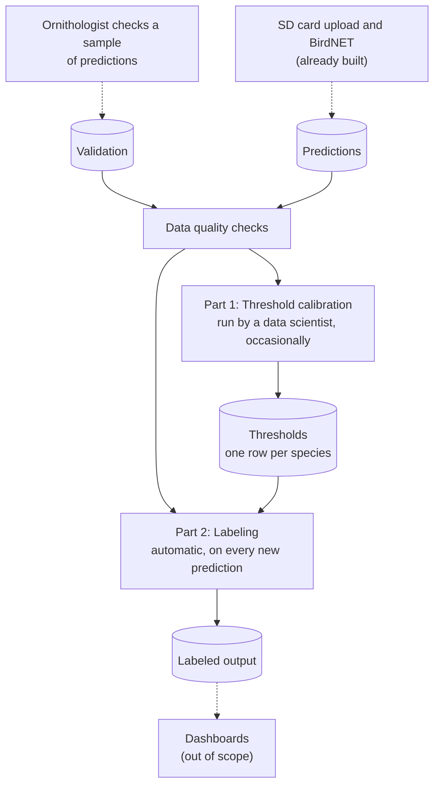

# Tech requirements: BirdNET observation pipeline

What the Tech team needs to build so the platform can turn BirdNET predictions into observations, show them on dashboards, and repeat the process as new data arrive. The analysis is already done. For the data, the reasoning and the decisions behind it, see [bird_analysis.md](bird_analysis.md).

## 1. Purpose

BirdNET stores a **prediction** (a species and a confidence score) for every 3-second segment of audio. There are too many to check by hand, and the confidence score is not a probability. An ornithologist checks a sample of predictions (the **validation** data). From that sample, a **threshold** is calculated for each species: the lowest score at which a prediction has at least a 99% chance of being correct. A prediction at or above its species' threshold is an **observation**. Dashboards use only observations.

## 2. Pipeline

- **Data quality checks** test the inputs. A STOP result halts the run.
- **Part 1** calculates the thresholds from Validation and writes them to the Thresholds table.
- **Part 2** labels every prediction using the Thresholds table.
- Part 1 must run once before Part 2 can label anything. Until then, every prediction is left unlabeled.

## 3. Inputs

The tables are described using the column names in the sample files `birdnet_predictions.csv` and `validation_results.csv`. Only the columns the pipeline uses are listed.

**Predictions** (one row per prediction). Key: `begin_path` + `begin_time_s` + `common_name`.

| Column | Type | Rule |
|---|---|---|
| `begin_path` | text | Recording the prediction came from. Not empty |
| `begin_time_s` | integer | Segment start, in seconds. 0 or more |
| `common_name` | text | Species. Not empty |
| `confidence` | number | Greater than 0 and at most 1. Never rounded |
| `folder` | text | Recorder. Not empty |

**Validation** (one row per checked prediction). Key: `filename`.

| Column | Type | Rule |
|---|---|---|
| `commonName` | text | Species. Not empty |
| `vBirdNET` | text | BirdNET version, for example `v2.4` |
| `confidence` | number | Greater than 0 and at most 1 |
| `outcome` | integer | 0 or 1. `1` means the ornithologist judged the prediction correct |

The species values in `common_name` and `commonName` must be identical for the same species. The other columns in the sample files are not used.

## 4. Requirements

1. **Checks first.** Run the data quality checks (section 5). Checks on Predictions run every time new predictions are stored. Checks on Validation and across the two tables run every time thresholds are calculated.
2. **Calibration (Part 1).** For each species in Validation, calculate a threshold and a support level, and write them to the Thresholds table. The method is a logistic regression of `outcome` on the logit of `confidence` (scores clipped to 0.0001 to 0.9999), solved for a 99% probability of being correct. Use Firth regression when a species has fewer than 10 correct or fewer than 10 incorrect clips. Turn the fitted line into a threshold using the three rules below. A data scientist reviews the result before it is used.
3. **Thresholds table.** One row per species: species, threshold (empty if none), support level, method, and the date calculated. Keep earlier versions.
4. **Labeling (Part 2).** For each prediction, set `observation` to `common_name` if its species has a threshold and `confidence` is at or above it. Otherwise leave it empty. Compare the original score, not the clipped one.
5. **Labeled output.** The Predictions table plus the `observation` column, with the same rows as the input.
6. **Output checks.** Before publishing: the row count is unchanged, the key is still unique, every observation is at or above its species' threshold, every prediction at or above its threshold is labeled, each observation names its own species, and no species without a threshold has an observation. Any failure is a STOP.
7. **Publishing and dashboards.** Publish nothing until all checks have run. Record every check result: check, table, status, rows affected, and time run. Dashboards must show every FLAG result and each species' support level.
8. **Re-runs.** Run labeling on every new upload. Run calibration again when new validation data arrive or conditions change (a new BirdNET version, new recording hardware, a new region or season).

**Turning a fitted line into a threshold.** Applied to each species in order:

| Rule | Result | Support level |
|---|---|---|
| The fitted probability is already 99% or more at the lowest validated score | Threshold is that lowest validated score, so every prediction qualifies | Weak |
| Otherwise the line never reaches 99% within the validated scores, or its slope is not positive | No threshold, so no observations for that species | No threshold |
| Otherwise | Threshold is the score where the line reaches 99% | Solid if the 95% interval for the slope excludes 0, otherwise Weakly identified |

## 5. Data quality checks

Each check gives a status: **STOP** (halts the run and publishes nothing), **FLAG** (continues; recorded and shown to dashboard users) or **INFO** (continues; recorded). The sample data give no STOP. The full rules and the results on the sample are in [bird_analysis.md, section 1](bird_analysis.md#1-data-exploration-and-summaries).

| Status | Checks |
|---|---|
| **STOP** | *Predictions:* no missing values; `confidence` between 0 and 1; key unique. *Validation:* no missing values; `outcome` is 0 or 1; `filename` unique |
| **FLAG** | *Predictions:* species and species code match one-to-one; no stray spaces; no score of exactly 1.0; segments are 3 seconds; no overlapping segments; recording path has the expected form; recorder matches the path. *Validation:* species names match one-to-one; no stray spaces; `filename` has the expected form; `confidence` matches the filename; one BirdNET version; no score of exactly 1.0; both outcomes present for every species. *Across the tables:* same species; same date range; every validated recorder is in Predictions; every recorder has validation clips; recordings start on the hour; validation rows can be traced to a prediction |
| **INFO** | *Predictions:* segments end within an hour; one species per segment. *Validation:* no species is nearly one-sided. *Across the tables:* validation scores are representative of the predictions |

## 6. Reference values

The build should reproduce these on the sample data.

| Species | Threshold | Support level | Observations |
|---|---|---|---|
| Abyssinian Nightjar | 0.667 | Solid | 3,147 of 10,187 |
| African Black-headed Oriole | 0.100 (all predictions) | Weak | 18,054 of 18,054 |
| Three-banded Plover | 0.817 | Weakly identified | 114 of 1,015 |
| Red-billed Firefinch | none | No threshold | 0 of 235 |

In total, 21,315 of 29,491 predictions are observations. Why each threshold was chosen is explained in [bird_analysis.md, section 2](bird_analysis.md#2-modelling-from-confidence-scores-to-species-thresholds), and the decision to use the point estimates in [section 3.3](bird_analysis.md#33-decision-operate-at-the-point-estimates).

## 7. Open questions for Natural State

1. **Validation records.** Can they include `begin_path` and `begin_time_s` for each checked clip? Today a clip can only be traced to a prediction by an ambiguous match (see [section 1.3](bird_analysis.md#13-cross-file-checks)).
2. **BirdNET version.** Can Predictions include `vBirdNET`? Validation has it, and thresholds are only valid for the version they were calibrated on.
3. **Off-the-hour recordings.** 288 of 551 validation clips come from recordings that are not in Predictions. Where did they come from?
4. **Oriole.** Every Oriole prediction is labeled an observation, but the data cannot show that it reaches 99%. Label all, label none, or hold until more are checked?
5. **Unmatched validation rows.** They were kept and reported in the sample. Should production stop on them, or continue?
6. **Species identifier.** Common name (as in the sample) or a species code?
7. **Changed thresholds.** When thresholds change, should earlier predictions be relabeled?
8. **Minimum validation.** How many checked clips does a species need before its threshold is trusted? The analysis set no minimum.
9. **Sensitivity.** The analysis assumed BirdNET's default sensitivity of 1. Is that what Natural State used?
10. **Proposed rules.** The Firth rule (fewer than 10 clips) and the support levels in section 4 are proposals that match the analysis results. Please confirm them.
