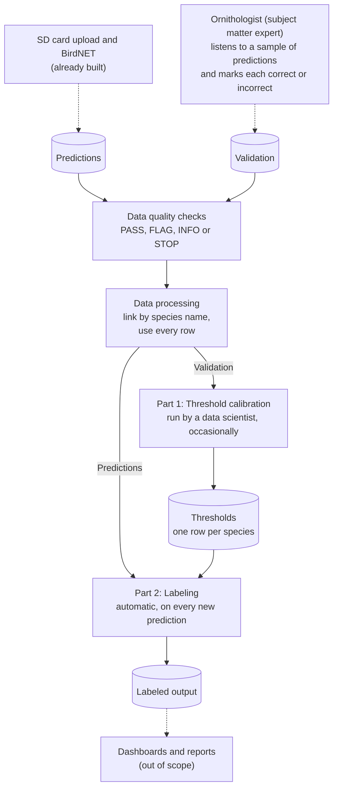
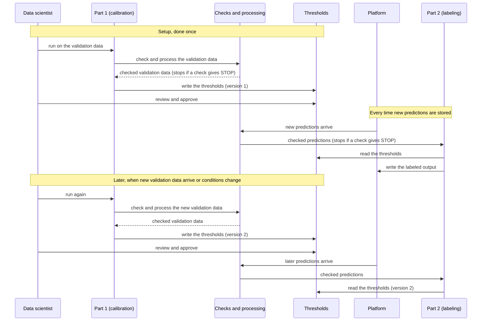

# Tech requirements: turning BirdNET predictions into observations

What the Tech team needs to build, run, and test the post- BirdNET ML pipeline for passive acoustic monitoring data on the Natural State Analytics platform.

## 1. Purpose

Projects record bird calls with passive acoustic monitoring devices. Once the recordings are uploaded, BirdNET analyzes the audio in 3-second segments and stores a **prediction** for each one: a species, and a confidence score between 0 and 1. A single upload produces a very large number of predictions. In the sample data, 29,491 predictions came from 1,696 recordings.

Two problems stop these predictions from being used directly:

- **There are too many to check by a subject matter expert.** An ornithologist can only validate a small sample.
- **The confidence score is not a probability.** A score of 0.80 does not mean "80% likely to be correct", and the same score means different things for different species (Wood & Kahl, 2024).

This pipeline decides which predictions are reliable enough to be treated as **observations**: records that a species was present, held to a quality standard of at least a 99% probability of being correct. It does this separately for each species, using a **threshold** (a minimum confidence score) calculated for that species from a sample of predictions that an ornithologist has already checked, called the **validation** data.

**What the pipeline produces.** For every prediction, an `observation` value: the species name if the prediction meets the standard, and empty if it does not. Dashboards and project reports then use only the labeled observations.

**Scope**

| | |
|---|---|
| **Starts from** | BirdNET predictions already stored on the platform |
| **Ends with** | Every prediction labeled as an observation or left unlabeled |
| **Not covered here** | SD card upload; running BirdNET; dashboards and reports; how ornithologists carry out validation (this document covers only the format their results must arrive in) |

## 2. Overview

The pipeline starts with **data quality checks** (section 4) and **data processing** (section 5), followed by two parts that are run sequentially and are joined by a **thresholds** table with one value for each species. **Data quality checks** test the Predictions and Validation tables and give each check a status. **Data processing** then links the two tables by species name and uses every row. **Part 1, threshold calibration,** works out a threshold for each species from the validation data. **Part 2, labeling,** compares every prediction's confidence score with its species' threshold and labels the ones that meet the threshold and can thus be labeled as observations. Calibration has to run first, because labeling needs the thresholds to exist.

### 2.1 The steps and the two parts

| | Data quality checks | Data processing | Part 1: Threshold calibration | Part 2: Labeling |
|---|---|---|---|---|
| **What it does** | Tests each table, and the two tables against each other, and gives each check a status: PASS, FLAG, INFO or STOP | Links the two tables by species name and uses every row. Nothing is added, changed or removed | Works out the minimum confidence score for each species at which a prediction counts as an observation | Labels each prediction as an observation if its score reaches its species' threshold |
| **Reads** | Predictions and Validation | Predictions and Validation, once the checks have run | The checked Validation table | The checked Predictions table and thresholds |
| **Writes** | The result of each check | Nothing new: the tables are the same as the input tables | Thresholds | Labeled output |
| **When it runs** | Checks on Predictions run every time new predictions are stored. Checks on Validation and across the two tables run every time thresholds are calculated | Straight after the checks, in the same two situations | At setup, then only when new validation data arrive or conditions change | Automatically, whenever new predictions are stored |
| **Run by** | The platform, as the first step of Part 1 and Part 2 | The platform, as part of Part 1 and Part 2 | A data scientist, who reviews the result before it is used downstream | The platform, with no manual step |

If any data quality check gives STOP, the run stops and nothing after it runs (section 4).

### 2.2 The four data tables

| Name | What it is | Where it comes from | Used by |
|---|---|---|---|
| **Predictions** | BirdNET's output: one row per prediction, giving the species, the confidence score, and which recording and which 3-second segment it came from | The existing ML pipeline, after each upload | Data quality checks, data processing, then Part 2 |
| **Validation** | Predictions that an ornithologist has listened to and marked correct or incorrect | The ornithologists' review (how this is captured on the platform is an open question) | Data quality checks, data processing, then Part 1 |
| **Thresholds** | One row per species: the minimum confidence score at which a prediction becomes an observation, or "none" if the species has no usable threshold | Written by Part 1 | Part 2 |
| **Labeled output** | Each prediction, together with its `observation` value (the species name, or empty) | Written by Part 2 | Dashboards and project reports |

### 2.3 How the data moves

In words: an ornithologist listens to a sample of BirdNET's predictions and marks each one correct or incorrect, which produces the **validation** table. BirdNET's predictions are stored as the **predictions** table. Both tables go through the data quality checks and then data processing. The checked validation data go into Part 1, which writes the **thresholds**. The checked predictions go into Part 2 together with the thresholds, and Part 2 writes the **labeled output**, which dashboards and reports then use. The dashed arrows mark the parts that are already built or out of scope, including how the ornithologist's work is recorded.

### 2.4 The order of events

In words:

1. Part 1 runs first. The validation data available at the time go through the data quality checks and data processing, and the checked data are used to work out the thresholds, which Part 1 writes. A data scientist reviews them before they are used.
2. From then on, whenever new predictions are stored, they go through the data quality checks and data processing, and Part 2 runs automatically on the checked predictions. It reads the current thresholds and writes the labeled output.
3. When new validation data arrive, or conditions change (the section on when to recalibrate lists them), Part 1 runs again: the new validation data go through the checks and processing, a data scientist reviews the new thresholds, and later predictions are labeled with the new version.
4. Before the first calibration there are no thresholds. In that case Part 2 leaves every prediction unlabeled. Labeling nothing is the safe default. Separately, if any data quality check gives STOP at any point, the run stops.

### 2.5 A worked example

These three predictions show how Part 2 decides. The scores are illustrative, and the Nightjar threshold of 0.667 is the one calculated from the sample data.

| Species | Confidence score | Species' threshold | Result |
|---|---|---|---|
| Abyssinian Nightjar | 0.72 | 0.667 | Labeled as an observation, because the score is at or above the threshold |
| Abyssinian Nightjar | 0.55 | 0.667 | Not labeled, because the score is below the threshold |
| Red-billed Firefinch | 0.90 | none | Not labeled, because this species has no threshold |

The rules behind each part, including how thresholds are calculated, are in the sections that follow.

## 3. Inputs

The pipeline reads two tables: **Predictions** (read by Part 2) and **Validation** (read by Part 1). For each one, this section lists the columns, their types, and the rules each column must meet.

Column names are the ones used in the sample files, `birdnet_predictions.csv` and `validation_results.csv`. Tables 3.1 and 3.2 list every column exactly as it appears in those files, including columns the pipeline does not use, so the Tech team can see the data as it will arrive. A column marked "No" under "Used by the pipeline" can stay on the table, but nothing in this document depends on it. Types are described in plain terms: *text*, *integer* (a whole number) and *number* (a decimal).

### 3.1 Predictions

Each row is one prediction: BirdNET's judgment that one species is calling in one 3-second segment of one recording. The table lists all 13 columns exactly as they appear in the sample file.

| Column | Type | Meaning | Rule | Used by the pipeline |
|---|---|---|---|---|
| `selection` | integer | A row counter within a selection table. It restarts for each audio file, so it is not a unique ID *(inferred)* | None | No |
| `view` | text | The display view the row was created in. Always `Spectrogram 1` in the sample | None | No |
| `channel` | integer | The audio channel analyzed. Always `1` in the sample | None | No |
| `begin_time_s` | integer | Where the 3-second segment starts, in seconds from the start of the recording | 0 or more | Yes |
| `end_time_s` | integer | Where the segment ends, in seconds. Always `begin_time_s` plus 3 in the sample | None | No |
| `low_freq_hz` | integer | Lower frequency bound of the analyzed band, in hertz. Always `0` in the sample | None | No |
| `high_freq_hz` | integer | Upper frequency bound of the analyzed band, in hertz. Always `15000` in the sample | None | No |
| `common_name` | text | The species BirdNET predicted | Not empty. Must use the same species values as `commonName` in Validation (see section 5) | Yes |
| `species_code` | text | A short code for the predicted species. One-to-one with `common_name` in the sample | None | No |
| `confidence` | number | BirdNET's confidence score for this prediction | Greater than 0 and at most 1. Used exactly as stored (4 decimal places in the sample), never rounded | Yes |
| `begin_path` | text | The audio recording the prediction came from, for example `Grid2/RBS02/RBS02_20230622_170000.WAV` | Not empty | Yes |
| `file_offset_s` | integer | The segment's offset within the recording, in seconds. Identical to `begin_time_s` in the sample | None | No |
| `folder` | text | The recorder (device) that made the recording, for example `RBS02` | Not empty | Yes, for quality checks by recorder |

**Key.** The combination of `begin_path`, `begin_time_s` and `common_name` must be unique. In the sample it is unique for all 29,491 rows. The species is part of the key because one segment can carry predictions for more than one species (3 segments in the sample do).

**About the sample's confidence values.** The lowest score in the sample is 0.1, because BirdNET did not store anything lower. The pipeline must not assume that minimum, so the rule above only requires a value greater than 0 and at most 1.

### 3.2 Validation

Each row is one prediction that an ornithologist has listened to and judged. The table lists all six columns exactly as they appear in the sample file.

| Column | Type | Meaning | Rule | Used by the pipeline |
|---|---|---|---|---|
| `scientificName` | text | The scientific (Latin) name of the predicted species | Not empty | No |
| `commonName` | text | The species BirdNET predicted | Not empty. Must use the same species values as `common_name` in Predictions | Yes |
| `vBirdNET` | text | The BirdNET version that produced the prediction, for example `v2.4` | Not empty | Yes, checked to be a single version |
| `filename` | text | The name of the audio clip the ornithologist checked, in the form `<confidence>_<n>_<recorder>_<YYYYMMDD>_<HHMMSS>.wav`. The leading number is the confidence score, `<n>` is a whole number whose meaning is not documented, and the recorder, date and start time identify the recording | Unique for each row. Follows the form shown | No |
| `confidence` | number | BirdNET's confidence score for the prediction that was checked | Greater than 0 and at most 1. Equal to the leading number in `filename` | Yes |
| `outcome` | integer | The ornithologist's verdict | Only 0 or 1: `1` means the prediction was correct, `0` means it was not | Yes |

**Key.** Each row is one checked prediction, so `filename` must be unique. In the sample it is unique for all 551 rows. The sample has no column that links a row to a row in Predictions. The only way to trace one is to compare the recording, species and score in `filename` with Predictions, which works for only some of the rows (see section 5).

**How many validated predictions are needed, and from which scores,** is a requirement on Part 1 and is covered under calibration.

## 4. Data quality checks

The first thing the pipeline does is check the data. The Predictions and Validation tables are checked, and so are the two tables against each other. Checks on the labeled output, which run before anything is published, are described later with the labeled output. This section lists the checks on the inputs, the status each one gives, and what the pipeline does with the results.

### 4.1 Statuses

Every check gives one of four statuses.

| Status | Meaning | What the pipeline does |
|---|---|---|
| **PASS** | Nothing to act on | Continues |
| **FLAG** | A problem that has to be handled in the analysis, or that a reader of the results needs to know about | Continues. The result is recorded and shown wherever the results are published |
| **INFO** | An oddity that is worth noting but is not a problem by itself | Continues. The result is recorded |
| **STOP** | The data cannot be processed correctly | The run stops, nothing is published, and the failing check is reported |

In the sample analysis, every check gave PASS, FLAG or INFO, and none stopped the analysis. STOP is an addition: it is given only by the structural checks marked "STOP" in the tables below, because the pipeline cannot work correctly if they fail. None of them failed in the sample.

### 4.2 Checks on the Predictions table

These run every time new predictions are stored, before they are labeled.

| Check | Rule | Status if it fails | In the sample |
|---|---|---|---|
| No missing values | No column has an empty value | STOP | 0 missing values |
| Species and species code match | Each `common_name` has exactly one `species_code`, and each `species_code` exactly one `common_name` | FLAG | 4 names, 4 codes, 4 pairs |
| No stray spaces | No text column has leading or trailing spaces | FLAG | 0 values affected |
| Confidence in range | `confidence` is greater than 0 and at most 1 | STOP | Range 0.1 to 1 |
| No score of exactly 1.0 | No `confidence` equals 1, because the logit of 1 is infinite and such scores must be clipped before it is calculated | FLAG | 4 predictions at 1.0 |
| Key is unique | Each combination of `begin_path`, `begin_time_s` and `common_name` appears once | STOP | 0 duplicate keys |
| Segments are 3 seconds | `end_time_s` minus `begin_time_s` equals 3 | FLAG | 0 rows differ |
| No overlapping segments | For one species in one recording, no two segments overlap | FLAG | 0 overlaps |
| Recording path has the expected form | `begin_path` has the form `Grid/Recorder/Recorder_YYYYMMDD_HHMMSS.WAV` | FLAG | 0 paths differ |
| Recorder matches the path | The recorder in `folder` is the same as the recorder in `begin_path` | FLAG | All rows match |
| Segments end within an hour | `end_time_s` is at most 3,600 | INFO | 14 segments end after 3,600 seconds (the latest at 3,602) |
| One species per segment | Each combination of `begin_path` and `begin_time_s` has only one species | INFO | 3 segments have more than one species |

### 4.3 Checks on the Validation table

These run every time the thresholds are calculated, before the validation data are used.

| Check | Rule | Status if it fails | In the sample |
|---|---|---|---|
| No missing values | No column has an empty value | STOP | 0 missing values |
| Species names match | Each `commonName` has exactly one `scientificName`, and each `scientificName` exactly one `commonName` | FLAG | 4 common names, 4 scientific names, 4 pairs |
| No stray spaces | No text column has leading or trailing spaces | FLAG | 0 values affected |
| Outcome is 0 or 1 | `outcome` is only ever 0 or 1 | STOP | 0 other values |
| Filename is unique | Each `filename` appears once, because it is the key | STOP | 0 duplicates |
| Filename has the expected form | `filename` has the form `<confidence>_<n>_<recorder>_<YYYYMMDD>_<HHMMSS>.wav` | FLAG | 0 filenames differ |
| Confidence matches the filename | `confidence` equals the leading number in `filename` | FLAG | All rows match |
| One BirdNET version | `vBirdNET` has a single value | FLAG | `v2.4` in every row |
| No score of exactly 1.0 | No `confidence` equals 1, because the logit of 1 is infinite and such scores must be clipped before it is calculated | FLAG | 2 clips at 1.0 |
| Both outcomes for every species | Each species has at least one correct (1) and one incorrect (0) clip | FLAG | The Oriole has only correct clips |
| No species is nearly one-sided | No species has just one correct or just one incorrect clip | INFO | The Plover has just one incorrect clip |

### 4.4 Checks across the two tables

These compare Predictions and Validation with each other. They run every time the thresholds are calculated.

| Check | Rule | Status if it fails | In the sample |
|---|---|---|---|
| Same species | The species in Predictions (`common_name`) and in Validation (`commonName`) are the same set | FLAG | 4 species in each |
| Same date range | The earliest and latest recording dates in Predictions (from `begin_path`) and in Validation (from `filename`) are the same | FLAG | 2023-06-20 to 2023-07-12 in both |
| Every validated recorder is in Predictions | Each recorder in the Validation `filename` values appears in the Predictions `folder` column | FLAG | 32 validated recorders, all in Predictions |
| Every recorder has validation clips | Each recorder in the Predictions `folder` column appears in the Validation `filename` values | FLAG | 11 of 43 recorders have none |
| Recordings start on the hour | Each recording in Validation starts on the hour, as every recording in Predictions does | FLAG | 288 of 551 validation clips come from recordings that start off the hour |
| Validation rows can be traced to a prediction | Each Validation row is matched to Predictions rows with the same recording (from `filename`), the same species, and the same `confidence` rounded to 3 decimals. The result is reported as none, one, or several matches | FLAG | See below |
| Scores are representative | For each species, the median `confidence` and the share of scores at 0.9 or higher are compared between Predictions and Validation, and the results are reported | INFO | Validation scores are higher than Predictions for three of the four species. The Nightjar median is 0.65 in Validation and 0.32 in Predictions |

For the traceability check, the sample gives:

| Recording start | No match | One match | Several matches |
|---|---|---|---|
| Starts off the hour | 288 | 0 | 0 |
| Starts on the hour | 10 | 207 | 46 |

None of the clips from off-the-hour recordings can match, because every recording in Predictions starts on the hour. The rows that match several predictions do so because, once scores are rounded to 3 decimals, the same score can occur more than once within a recording.

## 5. Data processing

This section describes what is done to the Predictions and Validation tables before the analysis (calculating the thresholds, then labeling). It follows the data quality checks in section 4 and matches what was done in the sample analysis: the tables are used as they are. No column is added, no value is changed, and no row is removed.

| Step | What is done | What happened in the sample analysis |
|---|---|---|
| 1 | Read both tables as received | Predictions (29,491 rows, 13 columns) and Validation (551 rows, 6 columns) were read from `birdnet_predictions.csv` and `validation_results.csv` |
| 2 | Run the data quality checks in section 4, and continue only if none of them gives STOP | All the checks were run. None gave STOP, so the analysis continued. The FLAG and INFO results are listed in section 4 |
| 3 | Use the species name to link the two tables: Validation rows are grouped by `commonName` when thresholds are calculated, and thresholds are applied to Predictions by `common_name`. The two columns must hold the same species values | Both tables have the same four species, spelled identically |
| 4 | Use every row. No row is removed or changed. Validation rows that cannot be traced back to a prediction are reported and kept | All 551 validation rows were used to calculate thresholds, and all 29,491 predictions were labeled. 288 of the 551 validation rows could not be traced to a prediction, because they come from recordings that are not in Predictions, and they were kept |

Two things that involve the scores happen later, and are not changes to the tables. Scores of exactly 1.0 are clipped to just below 1 when thresholds are calculated, because their logit is infinite. Labeling compares each prediction's original score with its species' threshold. Both are described in the sections on calibration and labeling.

The prepared tables are the same as the input tables. The Validation table is what the threshold calibration reads, and the Predictions table is what labeling reads.

## 6. Part 1: Threshold calibration

### 6.1 What Part 1 does

Part 1 reads the checked Validation table and writes one threshold for each species: the lowest confidence score at which a prediction of that species is treated as an observation. The standard is the one set in the assignment: a prediction counts as an observation if there is at least a 99% probability that it is correct.

The method follows Wood & Kahl (2024). It uses the clips the ornithologist checked to learn how a confidence score relates to the probability of being correct, using a logistic regression, and then finds the score at which that probability reaches 99%. This is done separately for each species, because the same score means different things for different species.

Part 1 is run by a data scientist, at setup and again when new validation data arrive or conditions change. The result is reviewed before it is used.

**What comes from where.** The paper provides the logistic regression on the logit of the confidence score, and the formula for the threshold. Several things in this section are not from the paper or the assignment. They are my own design choices, which the sample analysis used: clipping the scores, using Firth regression, the rule for choosing it, the rule for turning a fitted line into a threshold, and the support levels. Each is marked "my design" where it appears.

### 6.2 The steps, for each species

The steps below are repeated for each species in the Validation table.

**Step 1. Select the species' clips.** Take the rows of the checked Validation table where `commonName` is that species. The sample had a single BirdNET version, so no further selection by `vBirdNET` was needed.

**Step 2. Transform the confidence scores.** Two operations, in this order:

- **Clip** `confidence` so that it is no lower than 0.0001 and no higher than 0.9999 *(my design)*.
- **Take the logit** of the clipped score `c`: `ln(c / (1 - c))`.

Why: on the 0 to 1 scale, scores near 1 are squeezed close together, and the logit spreads them out. The paper recommends fitting on the logit scale for this reason. The clipping is needed because the logit of exactly 1 is infinite. In the sample, only 2 Validation clips scored exactly 1.0, both for the Nightjar, and the Nightjar threshold was the same when scores were clipped at 0.001, 0.0001 or 0.00001.

One assumption sits behind this step. BirdNET's own definition of the logit divides by a "sensitivity" setting. The sample does not record that setting, so the sample analysis assumed BirdNET's default value of 1. A different value would change the scale of the logit but not which predictions end up above the threshold.

**Step 3. Fit a logistic regression.** Fit a model that relates the outcome (`1` correct, `0` incorrect) to the logit score. For any score, the fitted model gives the probability that a prediction is correct. It has an intercept and a slope, and the fitting method also reports a 95% interval for the slope.

Two versions of the fit are used, and the choice between them is my design:

- **Standard logistic regression** is the default.
- **Firth regression** is used when the species has fewer than 10 correct clips or fewer than 10 incorrect clips.

Why: when almost every clip is correct, or almost every clip is incorrect, the standard fit pushes the slope towards infinity (called separation) and gives meaningless results. Firth regression adds a small penalty that keeps the estimates finite.

In the sample, the Nightjar (117 correct, 33 incorrect) used the standard fit. The Oriole (150 correct, 0 incorrect), the Plover (149 correct, 1 incorrect) and the Firefinch (6 correct, 95 incorrect) used Firth regression. In the sample analysis the choice was made by looking at each species. The rule above gives the same choice for all four.

The sample analysis was done in R, using `glm` for the standard fit and `logistf` for Firth regression. The requirements do not say which tools the Tech team should use.
