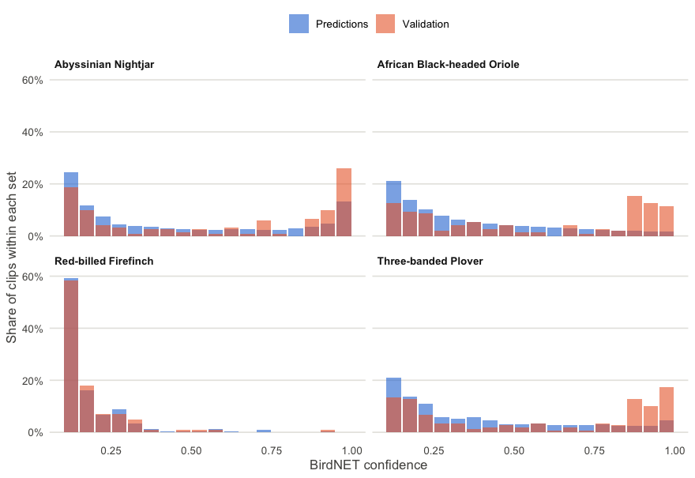
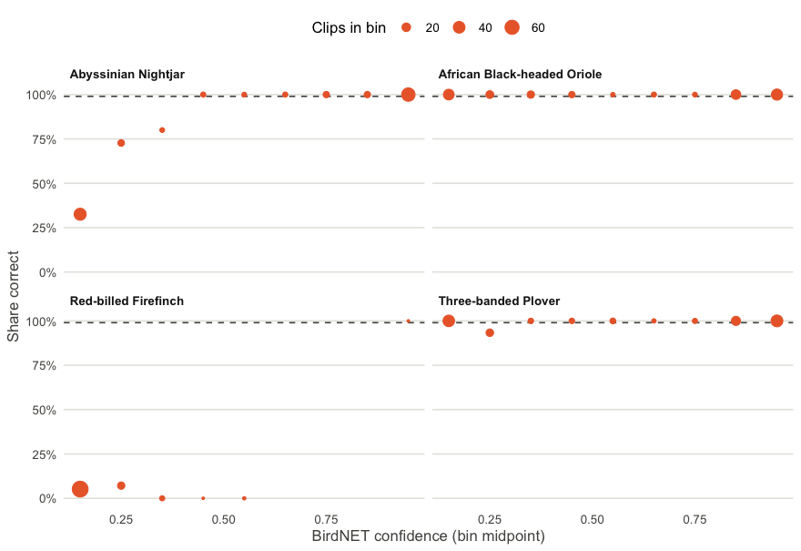
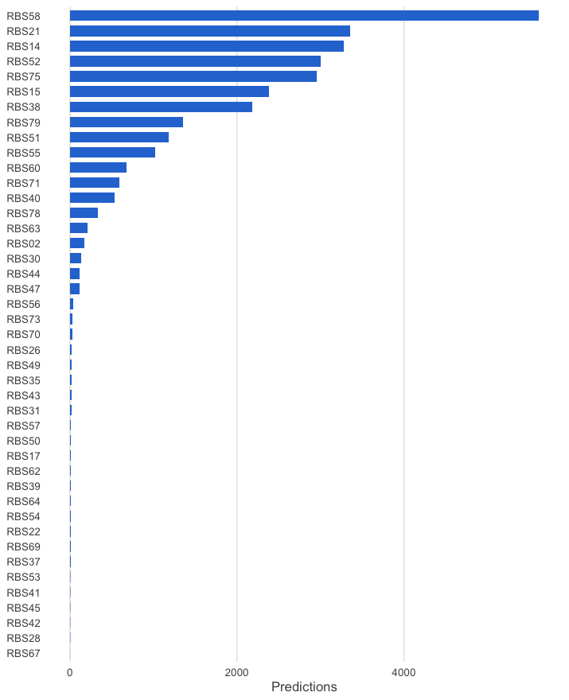
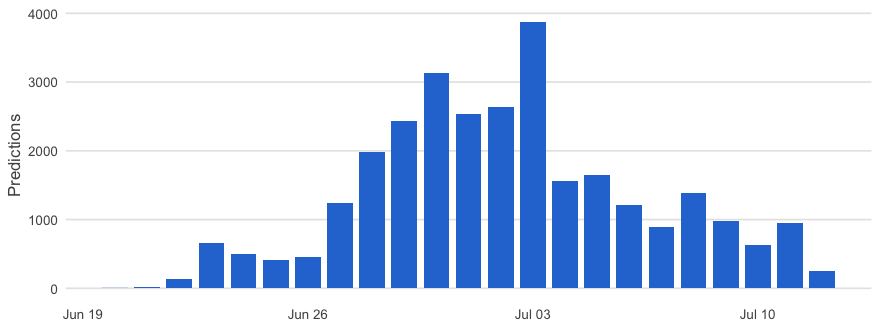
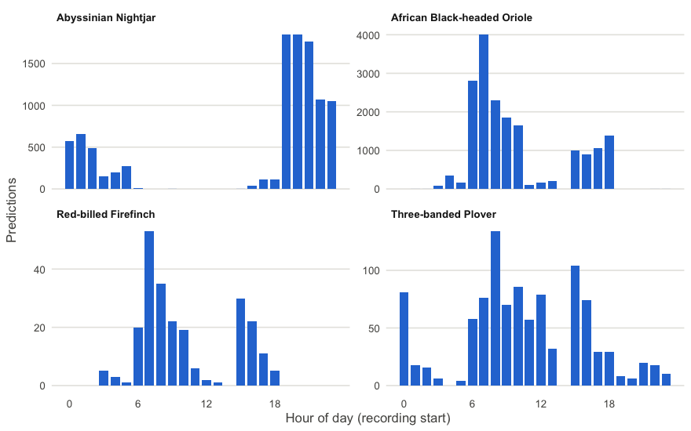
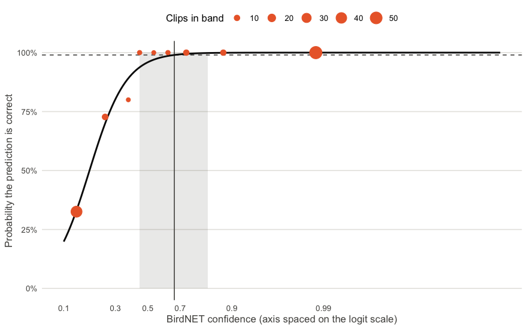
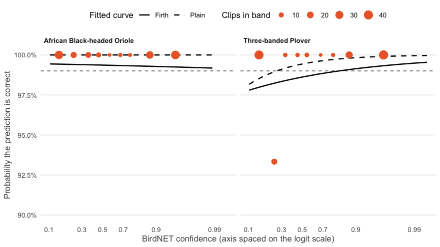

NS Take-Home Assignment - Bird Challenge
================

## Contents

1.  [Data exploration and summaries](#1-data-exploration-and-summaries)
    1.  [Data schema:
        `birdnet_predictions.csv`](#11-data-schema-birdnet_predictionscsv)
    2.  [Data schema:
        `validation_results.csv`](#12-data-schema-validation_resultscsv)
    3.  [Cross-file checks](#13-cross-file-checks)
    4.  [Distributions](#14-distributions)
2.  [Modelling: from confidence scores to species
    thresholds](#2-modelling-from-confidence-scores-to-species-thresholds)
    1.  [Approach](#21-approach)
    2.  [Reference case: Abyssinian
        Nightjar](#22-reference-case-abyssinian-nightjar)
    3.  [Oriole and Plover: when the standard fit
        breaks](#23-oriole-and-plover-when-the-standard-fit-breaks)
    4.  [Firefinch: no threshold
        exists](#24-firefinch-no-threshold-exists)
    5.  [The paper’s formula compared with the three-part
        rule](#25-the-papers-formula-compared-with-the-three-part-rule)
3.  [Labelling the predictions](#3-labelling-the-predictions)
    1.  [Thresholds and the `observation`
        field](#31-thresholds-and-the-observation-field)
    2.  [Checks on the labels](#32-checks-on-the-labels)
    3.  [Decision: operate at the point
        estimates](#33-decision-operate-at-the-point-estimates)

## 1. Data exploration and summaries

### 1.1 Data schema: `birdnet_predictions.csv`

29,491 rows, 13 fields, no missing values. Each row is one BirdNET
*prediction*: one species predicted in one 3-second segment of one audio
file, with a confidence score of at least 0.1. The field layout is the
Raven selection-table format that BirdNET writes out. Descriptions below
are my reading of the data and the take-home assignment description;
items marked *(inferred)* are not stated in the description.

| Field | Type | Description | Observed in this dataset |
|----|----|----|----|
| `selection` | numeric (integer) | Row counter within a Raven selection table. Restarts for each audio file, so it is **not** a unique ID. *(inferred)* | 1 to 270 |
| `view` | character | Raven display view the selection was made in. Constant. | Always `Spectrogram 1` |
| `channel` | numeric (integer) | Audio channel analysed. Constant. | Always `1` |
| `begin_time_s` | numeric (integer) | Start of the 3-second segment, in seconds from the start of the audio file. | 0 to 3,599 |
| `end_time_s` | numeric (integer) | End of the segment, in seconds from the start of the file. Always `begin_time_s + 3`. | 3 to 3,602 |
| `low_freq_hz` | numeric | Lower frequency bound of the analysed band (Hz). Constant. | Always `0` |
| `high_freq_hz` | numeric | Upper frequency bound of the analysed band (Hz). Constant. | Always `15000` |
| `common_name` | character | Predicted species (the class). | 4 species: Abyssinian Nightjar, African Black-headed Oriole, Red-billed Firefinch, Three-banded Plover |
| `species_code` | character | Short code for the predicted species. One-to-one with `common_name`. | 4 codes: species_code: abynig1, abhori1, rebfir2, thbplo1 |
| `confidence` | numeric | BirdNET confidence score for this species in this segment. **Not a probability**; its meaning differs by species (Wood & Kahl 2024). Predictions below 0.1 were not kept. | 0.1 to 1.0 |
| `begin_path` | character | Relative path to the source audio file: `Grid/Recorder/Recorder_YYYYMMDD_HHMMSS.WAV`. Encodes the recorder, date and start hour of a 1-hour recording. | 1,696 distinct files, all in `Grid2` |
| `file_offset_s` | numeric (integer) | Offset of the segment within the file, in seconds. Identical to `begin_time_s` in every row, so redundant. | 0 to 3,599 |
| `folder` | character | Recorder (device) ID. Matches the recorder folder inside `begin_path`. | 43 recorders (`RBS02`, …) |

**Key and constants.** No single field identifies a prediction. The
combination `begin_path` + `begin_time_s` + `common_name` is unique for
all 29,491 rows, and that is the key I will use when labelling. `view`,
`channel`, `low_freq_hz` and `high_freq_hz` never vary and carry no
information for the analysis.

``` r
# Reproduces the claims above directly from the data
predictions %>%
  summarise(
    rows = n(),
    missing_cells = sum(is.na(across(everything()))),
    unique_key_rows = n_distinct(begin_path, begin_time_s, common_name),
    offset_equals_begin = all(file_offset_s == begin_time_s),
    segment_is_3s = all(end_time_s - begin_time_s == 3),
    recorder_matches_path = all(str_split_i(begin_path, "/", 2) == folder)
  ) %>%
  pivot_longer(everything())
```

    ## # A tibble: 6 × 2
    ##   name                  value
    ##   <chr>                 <int>
    ## 1 rows                  29491
    ## 2 missing_cells             0
    ## 3 unique_key_rows       29491
    ## 4 offset_equals_begin       1
    ## 5 segment_is_3s             1
    ## 6 recorder_matches_path     1

Predictions per species:

``` r
predictions %>% count(common_name, species_code, sort = TRUE)
```

    ## # A tibble: 4 × 3
    ##   common_name                 species_code     n
    ##   <chr>                       <chr>        <int>
    ## 1 African Black-headed Oriole abhori1      18054
    ## 2 Abyssinian Nightjar         abynig1      10187
    ## 3 Three-banded Plover         thbplo1       1015
    ## 4 Red-billed Firefinch        rebfir2        235

#### QC checks: predictions

Each check is computed from the data when this document is knitted.
**PASS** means nothing to act on. **FLAG** means a problem I have to
handle in the analysis. **INFO** means an oddity to be aware of and
record, not necessarily a problem.

| Check | Result | Status |
|:---|:---|:--:|
| No missing values | 0 missing cells | PASS |
| `common_name` and `species_code` map one-to-one | 4 names, 4 codes, 4 distinct pairs | PASS |
| No leading/trailing whitespace in text fields | 0 values affected | PASS |
| `confidence` within 0.1 to 1 | range 0.1 to 1 | PASS |
| No `confidence` of exactly 1.0 (its logit is infinite) | 4 predictions at 1.0; clip before the logit transform | FLAG |
| Key (`begin_path`, `begin_time_s`, `common_name`) is unique | 0 duplicate keys | PASS |
| Every segment is 3 s long | 0 rows differ | PASS |
| No overlapping segments for the same species in a file | 0 overlaps | PASS |
| `begin_path` follows `Grid/Recorder/Recorder_YYYYMMDD_HHMMSS.WAV` | 0 paths differ | PASS |
| Recorder in `folder` matches recorder in `begin_path` | all rows match | PASS |
| Segments end within a 3,600 s recording | 14 segments end after 3,600 s (latest end 3602 s) | INFO |
| One species predicted per segment | 3 segments have more than one species | INFO |

**Reading the flags.** The four `confidence` values of exactly 1.0
cannot go through the logit transform (`ln(c / (1 - c))` is infinite),
so they need to be clipped to just below 1 OR removed from the data;
either way, this will be recoded as a decision with context for the tech
team to be aware of. The INFO rows are small oddities: a few segments
run up to 2 seconds past the one-hour mark, and 3 segments have
predictions for two species, which is another reason the key includes
the species.

### 1.2 Data schema: `validation_results.csv`

551 rows, 6 fields, no missing values. Each row is one BirdNET
prediction that a human ornithologist listened to and marked correct or
incorrect. This is the only file with ground truth, so it is what the
threshold model is fitted on. Items marked *(inferred)* are my reading
and are not stated in the take-home assignment description.

| Field | Type | Description | Observed in this dataset |
|----|----|----|----|
| `scientificName` | character | Scientific (Latin) name of the predicted species. One-to-one with `commonName`. | 4 species: *Caprimulgus poliocephalus*, *Charadrius tricollaris*, *Lagonosticta senegala*, *Oriolus larvatus* |
| `commonName` | character | Predicted species (the class). Same labels as `common_name` in the predictions file. | 4 species: Abyssinian Nightjar, Three-banded Plover, Red-billed Firefinch, African Black-headed Oriole |
| `vBirdNET` | character | BirdNET model version that produced the prediction. Constant. | Always `v2.4` |
| `filename` | character | Name of the validated audio clip: `<confidence>_<n>_<recorder>_<YYYYMMDD>_<HHMMSS>.wav`. The leading number is the confidence score, so clips can be matched to scores (Wood & Kahl 2024). `<n>` is an integer of unknown meaning, possibly a clip index *(inferred)*. Unique per row. | 551 distinct filenames; 32 recorders; dates 2023-06-20 to 2023-07-12 |
| `confidence` | numeric | BirdNET confidence score for the validated prediction. Identical to the leading number in `filename`. Rounded to 3 decimals, whereas the predictions file keeps 4. | 0.101 to 1.0 |
| `outcome` | numeric (0/1) | Ornithologist’s verdict: `1` = prediction correct (true positive), `0` = incorrect (false positive). This is the response variable. | 422 correct (1), 129 incorrect (0) |

**Notes.**

- The two files have no shared ID, and many validation clips cannot be
  traced back to a row in the predictions file (some come from
  recordings that start off the hour, unlike every file in the
  predictions). This does not affect fitting, which needs only
  `confidence` and `outcome`, for now flag but follow up with question
  before deciding. Details are in [1.3](#13-cross-file-checks).
- Correctness varies hugely by species (see below), which is what makes
  a single global threshold inappropriate.

``` r
# Reproduces the claims above directly from the data
validation %>%
  summarise(
    rows = n(),
    missing_cells = sum(is.na(across(everything()))),
    unique_filenames = n_distinct(filename),
    one_model_version = n_distinct(vBirdNET) == 1,
    outcome_is_0_or_1 = all(outcome %in% c(0, 1)),
    confidence_matches_filename = all(abs(as.numeric(str_extract(filename, "^[0-9.]+")) - confidence) < 1e-9),
    recorders = n_distinct(str_match(filename, "^[0-9.]+_[0-9]+_([A-Za-z0-9]+)_")[, 2])
  ) %>%
  pivot_longer(everything())
```

    ## # A tibble: 7 × 2
    ##   name                        value
    ##   <chr>                       <int>
    ## 1 rows                          551
    ## 2 missing_cells                   0
    ## 3 unique_filenames              551
    ## 4 one_model_version               1
    ## 5 outcome_is_0_or_1               1
    ## 6 confidence_matches_filename     1
    ## 7 recorders                      32

Validated clips and correct rate per species:

``` r
validation %>%
  group_by(commonName, scientificName) %>%
  summarise(n = n(),
            n_correct = sum(outcome),
            pct_correct = round(100 * mean(outcome), 1),
            min_conf = min(confidence),
            max_conf = max(confidence),
            .groups = "drop") %>%
  arrange(desc(pct_correct)) %>%
  knitr::kable(
    col.names = c("Species", "Scientific name", "Clips validated", "Correct",
                  "% correct", "Lowest score", "Highest score"),
    align = "llrrrrr"
  )
```

| Species | Scientific name | Clips validated | Correct | % correct | Lowest score | Highest score |
|:---|:---|---:|---:|---:|---:|---:|
| African Black-headed Oriole | Oriolus larvatus | 150 | 150 | 100.0 | 0.104 | 0.989 |
| Three-banded Plover | Charadrius tricollaris | 150 | 149 | 99.3 | 0.102 | 0.994 |
| Abyssinian Nightjar | Caprimulgus poliocephalus | 150 | 117 | 78.0 | 0.102 | 1.000 |
| Red-billed Firefinch | Lagonosticta senegala | 101 | 6 | 5.9 | 0.101 | 0.907 |

**What this shows.** Before fitting anything, this is how well BirdNET’s
predictions held up when a human checked them. The overall rate (422 of
551, 77%) hides large differences: every Oriole clip was correct, nearly
every Plover clip was correct, the Nightjar was in between, and the
Firefinch was almost always wrong. The lowest and highest scores show
the range of confidence each species was validated across, which limits
where a fitted curve can be trusted.

#### QC checks: validation

| Check | Result | Status |
|:---|:---|:--:|
| No missing values | 0 missing cells | PASS |
| `scientificName` and `commonName` map one-to-one | 4 common names, 4 scientific names, 4 distinct pairs | PASS |
| No leading/trailing whitespace in text fields | 0 values affected | PASS |
| `outcome` is 0 or 1 | 0 other values | PASS |
| `filename` is unique | 0 duplicates | PASS |
| `filename` follows `confidence_n_Recorder_YYYYMMDD_HHMMSS.wav` | 0 filenames differ | PASS |
| `confidence` equals the score in `filename` | all rows match | PASS |
| Single BirdNET version | v2.4 | PASS |
| No `confidence` of exactly 1.0 (its logit is infinite) | 2 clips at 1.0; clip before the logit transform | FLAG |
| Every species has both correct and incorrect clips | all clips have the same outcome for: African Black-headed Oriole | FLAG |
| No species is nearly one-sided (only 1 correct or 1 incorrect clip) | 1 clip differs for: Three-banded Plover | INFO |

**Reading the flags.** The file is structurally clean. The two
substantive flags are about the modelling. Two clips sit at exactly 1.0
and need the same clipping as the predictions. More importantly, one
species has only correct clips, and another has a single incorrect clip.
A standard logistic regression has no stable solution when the outcome
never varies (“perfect separation”), so those species need an explicit
rule; this is a modelling decision I make in the next section.

### 1.3 Cross-file checks

The two files should describe the same recordings and species. These
checks compare them directly.

| Check | Result | Status |
|:---|:---|:--:|
| Same species in both files | 4 in predictions, 4 in validation | PASS |
| Same date range in both files | predictions 20230620 to 20230712; validation 20230620 to 20230712 | PASS |
| Every validated recorder appears in the predictions | 32 validated recorders | PASS |
| Every recorder in the predictions has validation clips | 11 of 43 recorders have none | FLAG |
| Validation recordings start on the hour, like the predictions | 288 of 551 validation clips come from recordings starting off the hour | FLAG |

**Can the validated clips be traced back to a prediction?** Matching on
recording, species and confidence (to 3 decimals):

| Recording start | No matching prediction | One matching prediction | Several matching predictions |
|:---|---:|---:|---:|
| Starts off the hour | 288 | 0 | 0 |
| Starts on the hour | 10 | 207 | 46 |

All of the clips from off-the-hour recordings have no match, because
every file in the predictions starts on the hour. So a large part of the
validation set comes from recordings that are not in the predictions
file. Most of the on-the-hour clips do match, but a few match several
predictions (the same score occurs more than once in a file once it is
rounded to 3 decimals). This does not stop the threshold fit, which
needs only `confidence` and `outcome`, but it means I cannot say the
validation set is a subset of this predictions file. For now flag and
follow up with question before making a decision.

**Were the validated clips representative of the predictions?** Compare
the score distributions:

| Species | Set | n | Median score | Share at 0.9 or higher |
|:---|:---|---:|---:|---:|
| Abyssinian Nightjar | Predictions | 10187 | 0.32 | 18.0% |
| Abyssinian Nightjar | Validation | 150 | 0.65 | 36.0% |
| African Black-headed Oriole | Predictions | 18054 | 0.28 | 3.3% |
| African Black-headed Oriole | Validation | 150 | 0.57 | 26.0% |
| Red-billed Firefinch | Predictions | 235 | 0.14 | 0.4% |
| Red-billed Firefinch | Validation | 101 | 0.14 | 1.0% |
| Three-banded Plover | Predictions | 1015 | 0.29 | 7.3% |
| Three-banded Plover | Validation | 150 | 0.58 | 28.0% |

For three of the four species, the validated clips have much higher
scores than the predictions as a whole (the Nightjar median is about
twice as high). The validation set was therefore weighted towards high
scores rather than drawn at random. That is sensible for finding a
high-precision threshold, since it puts more clips where false positives
turn into true positives, as Wood & Kahl recommend. The consequence is
that the overall 77% correct rate from the validation file is **not**
the precision of the whole predictions file and should not be quoted as
such. The Firefinch is the exception: its validated and predicted scores
are both low, and almost no clip reaches 0.9.

### 1.4 Distributions

Four views of how the data are spread across scores, correctness,
recorders and time. The colours are fixed: blue for the predictions,
orange for the validation set. Each species gets its own panel, because
BirdNET scores mean different things for different species.

#### Score histograms per species: predictions vs validation set



Bars show the share of each set falling in each score bin, so the two
sets are comparable even though one has about 29,000 clips and the other
about 550. Where the orange bars sit well above the blue bars at high
scores, the validation set over-represents high-scoring clips. That is
the case for the Nightjar, Oriole and Plover. For the Firefinch the two
sets match, and most clips score below 0.2.

#### Share of validated clips that were correct, by score band and species



This is a model-free preview of what the logistic regression will
estimate: the share of validated clips that were correct, in bands of
score. The dashed line marks the 99% target, and the point size shows
how many clips each point rests on. Bands with only a few clips can jump
around, so read the large points first.

- **Nightjar:** the share correct climbs from about a third at the
  lowest scores to 100% from about 0.4 upwards, which is the shape the
  method expects.
- **Oriole:** every band is 100% correct, including the lowest scores.
  Nothing in the data shows where correctness starts to fail.
- **Plover:** the same, apart from a single incorrect clip in the 0.2 to
  0.3 band.
- **Firefinch:** almost every clip below 0.6 was wrong, and there is one
  clip above that, which was correct. One clip cannot support a
  threshold.

The Oriole and Plover panels are why the standard fit breaks down: even
the lowest-scoring clips were correct, so the data cannot show where
correctness starts to fail, and a threshold may sit at or below the
lowest score BirdNET reports (0.1). How to handle that is the main
modelling decision for the next section.

#### Predictions per recorder, from busiest to quietest



The predictions are concentrated in a few recorders. The five busiest
account for 62% of all predictions, and the busiest, RBS58, alone has
5,617. Many recorders contribute only a handful. Predictions from the
same recorder, and from neighbouring segments of a continuous call, are
not independent of each other, so the effective sample size is smaller
than the row count suggests. Thresholds fitted on the validation clips
are applied to all of these recorders, and 11 of them have no validation
clips (see 1.3).

#### Predictions per day and by hour of day (hour of day shown per species)





Predictions are available for every day from 20 June to 12 July 2023 but
the daily counts vary a lot. They reflect how much was recorded as well
as how much the birds called, and I don’t have the recording effort per
day, so I would not read the day-to-day pattern as bird activity. By
hour of day, the patterns differ by species: the Nightjar is
concentrated in the evening and the early morning hours, and the Oriole
peaks in the morning. Each panel has its own vertical scale, since the
species have very different numbers of predictions. Time of day is not
part of the planned fit, so any effect of it on scores would be absorbed
into a single curve per species rather than modelled.

## 2. Modelling: from confidence scores to species thresholds

### 2.1 Approach

BirdNET’s confidence score is not a probability, and it means something
different for each species (Wood & Kahl 2024). To decide which
predictions to treat as observations, I follow the method in that paper
for each species separately:

1.  Convert each confidence score `c` to the logit scale,
    `ln(c / (1 - c))`.
2.  Fit a logistic regression of the ornithologist’s verdict (`outcome`)
    on the logit score. This turns a score into an estimated probability
    that the prediction is correct.
3.  Solve the fitted model for the score at which that probability
    reaches 0.99, the target set in the assignment. That score is the
    species’ threshold.
4.  Label every prediction at or above its species’ threshold as an
    observation of that species.

Two choices apply to every species. Both are decisions rather than facts
about the data:

- **Clipping.** A score of exactly 1.0 has an infinite logit, so scores
  are clipped to the range 0.0001 to 0.9999. The data never show a value
  between 0.9999 and 1, so this is the closest finite value. Section 2.2
  checks that the choice does not matter for the Nightjar.
- **Sensitivity.** BirdNET’s logit is defined as `ln(c / (1 - c))`
  divided by a sensitivity setting. The data do not record that setting,
  so I assume the BirdNET default of 1. A different value would rescale
  the logit axis but would not change which predictions fall above the
  threshold, because the transform is the same monotonic stretch for
  every score.

I start with the Nightjar as a reference case, because its validation
data contain both correct and incorrect clips across the score range, so
the standard method should work as written. The other three species need
special handling and come after.

### 2.2 Reference case: Abyssinian Nightjar

``` r
clip_eps <- 1e-4
p_target <- 0.99

to_logit   <- function(c, eps = clip_eps) { c <- pmin(pmax(c, eps), 1 - eps); log(c / (1 - c)) }
from_logit <- function(l) 1 / (1 + exp(-l))
target_logit <- qlogis(p_target)   # logit of 0.99

nightjar <- validation %>%
  filter(commonName == "Abyssinian Nightjar") %>%
  mutate(logit_score = to_logit(confidence))

fit <- glm(outcome ~ logit_score, family = binomial, data = nightjar)

summary(fit)$coefficients %>%
  as_tibble(rownames = "Term") %>%
  mutate(across(c(Estimate, `Std. Error`, `z value`), ~ round(.x, 3)),
         `p value` = ifelse(`Pr(>|z|)` < 0.001, "<0.001", as.character(round(`Pr(>|z|)`, 3))),
         `Pr(>|z|)` = NULL) %>%
  knitr::kable(align = "lrrrr")
```

| Term        | Estimate | Std. Error | z value | p value |
|:------------|---------:|-----------:|--------:|--------:|
| (Intercept) |    3.159 |      0.819 |   3.855 | \<0.001 |
| logit_score |    2.072 |      0.495 |   4.182 | \<0.001 |

The slope is positive and clearly different from zero, so a higher score
does mean a higher chance of being correct, as the method assumes.
Solving the fitted model for a 99% chance of being correct gives the
threshold:

``` r
b <- coef(fit)
threshold_logit <- unname((target_logit - b[1]) / b[2])
threshold <- from_logit(threshold_logit)
```

The point estimate is **0.667**: Nightjar predictions scoring at least
this are classed as observations. A single number hides how uncertain it
is with 150 clips, so I estimate an interval two ways. The delta method
uses the model’s own standard errors. The bootstrap refits the model on
2,000 resamples of the 150 clips.

``` r
# Delta method, on the logit scale
g <- c(-1 / b[2], -(target_logit - b[1]) / b[2]^2)
se_logit <- sqrt(drop(t(g) %*% vcov(fit) %*% g))
delta_ci <- from_logit(threshold_logit + c(-1, 1) * 1.96 * se_logit)

# Bootstrap: refit on resampled clips, keeping track of any resample where
# the fit hits (near-)perfect separation and R warns about it
fit_threshold <- function(d) {
  warned <- FALSE
  f <- withCallingHandlers(
    glm(outcome ~ logit_score, family = binomial, data = d),
    warning = function(w) { warned <<- TRUE; invokeRestart("muffleWarning") })
  tibble(threshold_logit = unname((target_logit - coef(f)[1]) / coef(f)[2]), warned = warned)
}

set.seed(2026)
boot <- map_dfr(seq_len(2000), ~ fit_threshold(nightjar[sample(nrow(nightjar), replace = TRUE), ]))
boot_ci <- from_logit(quantile(boot$threshold_logit, c(0.025, 0.975)))

options(knitr.kable.NA = "")   # show blank cells instead of "NA"

tibble(
  Method = c("Point estimate", "Delta method, 95% interval", "Bootstrap, 95% interval"),
  Lower = c(NA, delta_ci[1], boot_ci[1]),
  Estimate = c(threshold, NA, NA),
  Upper = c(NA, delta_ci[2], boot_ci[2])
) %>%
  mutate(across(where(is.numeric), ~ round(.x, 3))) %>%
  knitr::kable()
```

| Method                     | Lower | Estimate | Upper |
|:---------------------------|------:|---------:|------:|
| Point estimate             |       |    0.667 |       |
| Delta method, 95% interval | 0.403 |          | 0.856 |
| Bootstrap, 95% interval    | 0.446 |          | 0.828 |

The two intervals agree reasonably well: the threshold is probably
between about 0.45 and 0.83. That is a wide range, which is expected
with 150 clips and only 33 incorrect ones. In 209 of the 2,000 bootstrap
resamples (10%), the resampled data came close to perfect separation, so
the model warned that some fitted probabilities were effectively 0 or 1.
I kept those resamples in. Dropping them would leave the interval too
narrow and shifted upwards, because those resamples produce lower
thresholds. They are a small preview of the problem that the Oriole and
Plover will have in full.

``` r
curve <- tibble(logit_score = seq(to_logit(0.1), to_logit(0.9999), length.out = 200))
curve$glm <- predict(fit, curve, type = "response")

gam_fit <- mgcv::gam(outcome ~ s(logit_score), family = binomial, data = nightjar)
curve$gam <- predict(gam_fit, curve, type = "response")

bands <- nightjar %>%
  mutate(band = cut(confidence, seq(0.1, 1, by = 0.1), include.lowest = TRUE)) %>%
  group_by(band) %>%
  summarise(n = n(), share_correct = mean(outcome), logit_score = mean(logit_score), .groups = "drop")

conf_ticks <- c(0.1, 0.3, 0.5, 0.7, 0.9, 0.99)

ggplot() +
  annotate("rect", xmin = quantile(boot$threshold_logit, 0.025), xmax = quantile(boot$threshold_logit, 0.975),
           ymin = 0, ymax = 1, fill = ink, alpha = 0.12) +
  geom_hline(yintercept = p_target, linetype = "dashed", colour = ink) +
  geom_vline(xintercept = threshold_logit, colour = ink) +
  geom_line(data = curve, aes(logit_score, gam), colour = ink, linetype = "dotted") +
  geom_line(data = curve, aes(logit_score, glm), colour = "#0b0b0b", linewidth = 0.9) +
  geom_point(data = bands, aes(logit_score, share_correct, size = n), colour = col_val) +
  scale_x_continuous(breaks = to_logit(conf_ticks), labels = conf_ticks) +
  scale_y_continuous(labels = scales::percent, limits = c(0, 1)) +
  scale_size_area(max_size = 6, name = "Clips in band") +
  labs(x = "BirdNET confidence (axis spaced on the logit scale)",
       y = "Probability the prediction is correct") +
  bird_theme
```



The solid line is the fitted logistic curve. The orange points are the
validated clips grouped into score bands, with larger points resting on
more clips. The dashed horizontal line is the 99% target, the vertical
line is the threshold, and the shaded band is its bootstrap interval.
The dotted line is a flexible alternative curve, used in the check
below.

**Does a straight line on the logit scale fit?** The method assumes so.
I compared the logistic regression with a flexible smooth (a generalised
additive model) on the same data:

``` r
tibble(
  Model = c("Logistic regression (straight line on logit scale)", "Flexible smooth (GAM)"),
  AIC = c(AIC(fit), AIC(gam_fit)),
  `Effective parameters` = c(2, sum(gam_fit$edf)),
  `Score where 99% is reached` = c(threshold, from_logit(curve$logit_score[which(curve$gam >= p_target)[1]]))
) %>%
  mutate(across(where(is.numeric), ~ round(.x, 3))) %>%
  knitr::kable()
```

| Model | AIC | Effective parameters | Score where 99% is reached |
|:---|---:|---:|---:|
| Logistic regression (straight line on logit scale) | 79.59 | 2 | 0.667 |
| Flexible smooth (GAM) | 79.59 | 2 | 0.674 |

The flexible model settles on an almost straight line (about 2 effective
parameters, the same as the logistic regression), has the same AIC, and
reaches 99% at nearly the same score. So the data give no reason to
prefer anything other than the straight-line model.

**Does the clipping choice matter?** Two Nightjar clips score exactly
1.0 and are affected by clipping. Re-fitting with different clip values:

``` r
map_dfr(c(1e-3, 1e-4, 1e-5), function(eps) {
  d <- nightjar %>% mutate(logit_score = to_logit(confidence, eps))
  f <- glm(outcome ~ logit_score, family = binomial, data = d)
  tibble(`Clipped to` = paste0(eps, " to ", 1 - eps),
         Threshold = from_logit((target_logit - coef(f)[1]) / coef(f)[2]))
}) %>%
  mutate(Threshold = round(Threshold, 3)) %>%
  knitr::kable()
```

| Clipped to       | Threshold |
|:-----------------|----------:|
| 0.001 to 0.999   |     0.667 |
| 1e-04 to 0.9999  |     0.667 |
| 1e-05 to 0.99999 |     0.667 |

The threshold does not change, so the clipping choice has no effect for
this species.

**What the fit says about the Nightjar.** Two things are worth
recording.

``` r
high_scoring <- nightjar %>% filter(confidence >= 0.4)
n_pred_nightjar <- sum(predictions$common_name == "Abyssinian Nightjar")
n_obs_nightjar  <- sum(predictions$common_name == "Abyssinian Nightjar" & predictions$confidence >= threshold)
```

- **The model is more cautious than the raw score bands.** All 91
  validated Nightjar clips scoring 0.4 or more were correct, yet the
  fitted curve only reaches 99% at about 0.67. A likely reason is that
  the logistic curve has to describe the many low-scoring clips, where
  only about a third were correct, and the same smooth S-shape then
  reaches 99% later than the raw bands do. A single curve cannot match
  every part of the data exactly, and here it errs on the cautious side.
  With only 150 clips, “all correct” above 0.4 is also not enough on its
  own to show 99% precision, which is why I prefer the model and its
  interval over reading a cut-off from the raw bands.
- **The threshold would label 3,147 of the 10,187 Nightjar predictions
  (31%) as observations.** The wide interval means that number would
  move noticeably if the true threshold were at either end of it.
  Whether to operate at the point estimate or the more cautious end of
  the interval is a decision I come back to once all four species are
  fitted.

### 2.3 Oriole and Plover: when the standard fit breaks

The Oriole and Plover were almost never wrong in the validation set: 150
of 150 and 149 of 150 clips were correct. That breaks the standard
method in a specific way, so it needs its own treatment.

**What goes wrong.** An ordinary logistic regression chooses the curve
that fits the data best. When every clip (or all but one) is correct,
the best-fitting curve is a perfect step from “wrong” to “right”, and
the slope of the fitted line runs off towards infinity. The standard
software either reports a nonsensical slope and warns about
“separation”, or returns an estimate that depends almost entirely on one
clip. The paper’s formula for the threshold divides by that slope, so it
breaks too.

**What I use instead: Firth regression.** Firth’s method is a standard
fix for this problem. It adds a small penalty that stops the
coefficients running away, so the estimates stay finite and the
intervals stay sensible. It is still a logistic regression on the logit
score, so it stays within the method in the paper. The price is that it
pulls the fit towards a flatter line, and it cannot create information
that the data do not contain.

**A rule for turning any fitted line into a threshold.** The paper’s
formula only makes sense when the slope is positive and the 99% point
lies inside the range of scores that were actually validated. So I apply
this rule to every fit:

1.  If the fitted probability of being correct is already at least 99%
    at the **lowest validated score**, the threshold is that lowest
    validated score. Every prediction at or above it counts as an
    observation.
2.  Otherwise, if the fitted line never reaches 99% within the validated
    range (or the slope is not positive), there is **no threshold**, and
    no predictions for that species can be called observations.
3.  Otherwise, the threshold is the score where the fitted line crosses
    99%, using the paper’s formula.

**This rule is my own design.** It is not part of the assignment or of
the Wood & Kahl paper. The paper supplies the formula in step 3. Steps 1
and 2 cover the cases where that formula cannot be applied safely.
Section 2.5 compares the rule with applying the formula literally.

``` r
op_species <- c("African Black-headed Oriole", "Three-banded Plover")
op_data <- map(set_names(op_species), function(sp) {
  validation %>% filter(commonName == sp) %>% mutate(logit_score = to_logit(confidence))
})

# The three-part rule described above
apply_rule <- function(b0, b1, d) {
  lowest <- min(d$logit_score)
  highest <- max(d$logit_score)
  p_lowest <- plogis(b0 + b1 * lowest)
  p_highest <- plogis(b0 + b1 * highest)
  if (p_lowest >= p_target) {
    tibble(p_lowest = p_lowest, p_highest = p_highest,
           outcome = "Met at the lowest validated score", threshold = from_logit(lowest))
  } else if (b1 <= 0 || p_highest < p_target) {
    tibble(p_lowest = p_lowest, p_highest = p_highest,
           outcome = "Not reached within the validated range", threshold = NA_real_)
  } else {
    tibble(p_lowest = p_lowest, p_highest = p_highest,
           outcome = "Reached within the validated range",
           threshold = from_logit((target_logit - b0) / b1))
  }
}

# Fit both the plain and the Firth model, noting whether the plain fit warned
fit_both <- function(d) {
  warned <- FALSE
  plain <- withCallingHandlers(
    glm(outcome ~ logit_score, family = binomial, data = d),
    warning = function(w) { warned <<- TRUE; invokeRestart("muffleWarning") })
  list(plain = plain, firth = logistf::logistf(outcome ~ logit_score, data = d), warned = warned)
}
op_fits <- map(op_data, fit_both)

op_results <- imap_dfr(op_fits, function(f, sp) {
  d <- op_data[[sp]]
  firth_interval <- sprintf("%.2f to %.2f", f$firth$ci.lower[2], f$firth$ci.upper[2])
  bind_rows(
    tibble(Species = sp, Method = ifelse(f$warned, "Plain logistic regression (did not converge)", "Plain logistic regression"),
           Slope = coef(f$plain)[2], `Slope 95% interval` = "") %>%
      bind_cols(apply_rule(coef(f$plain)[1], coef(f$plain)[2], d)),
    tibble(Species = sp, Method = "Firth", Slope = coef(f$firth)[2], `Slope 95% interval` = firth_interval) %>%
      bind_cols(apply_rule(coef(f$firth)[1], coef(f$firth)[2], d))
  )
})

op_results %>%
  transmute(Species, Method,
            Slope = round(Slope, 2),
            `Slope 95% interval`,
            `Probability correct at lowest validated score` = scales::percent(p_lowest, accuracy = 0.1),
            Outcome = outcome,
            Threshold = round(threshold, 3)) %>%
  knitr::kable(align = "llrrrll")
```

| Species | Method | Slope | Slope 95% interval | Probability correct at lowest validated score | Outcome | Threshold |
|:---|:---|---:|---:|---:|:---|:---|
| African Black-headed Oriole | Plain logistic regression (did not converge) | 0.00 |  | 100.0% | Met at the lowest validated score | 0.104 |
| African Black-headed Oriole | Firth | -0.06 | -3.98 to 3.25 | 99.4% | Met at the lowest validated score | 0.104 |
| Three-banded Plover | Plain logistic regression | 0.55 |  | 98.2% | Reached within the validated range | 0.259 |
| Three-banded Plover | Firth | 0.22 | -0.54 to 1.72 | 97.8% | Reached within the validated range | 0.817 |

**Reading the table.**

- **Oriole, plain regression:** it did not converge. The slope is
  essentially zero and the intercept is very large, which is the
  “perfect step” problem showing up as meaningless coefficients.
- **Oriole, Firth:** the estimates are finite but the slope is slightly
  *negative*, and its interval is wide and spans zero. In other words
  the score carries no usable information about whether an Oriole
  prediction is right, because almost all of them are. The fitted
  probability of being correct is already above 99% at the lowest
  validated score, so the rule gives the lowest validated score as the
  threshold. Applying the paper’s formula directly here would give a
  meaningless answer, because the slope is not positive.
- **Plover, plain regression:** it converges, because there is one
  incorrect clip to anchor it, and it gives a threshold of about 0.26.
- **Plover, Firth:** the slope is much smaller, and its interval also
  spans zero. The fitted probability starts a little below 99% at the
  lowest score and crosses it at about 0.82.

The two Plover thresholds (0.26 and 0.82) differ by a factor of three.
One incorrect clip is driving the whole answer, which is the sign that
this threshold is **weakly identified**: the data barely show how the
chance of being correct changes with score.

``` r
op_curves <- imap_dfr(op_data, function(d, sp) {
  grid <- tibble(logit_score = seq(min(d$logit_score), max(d$logit_score), length.out = 100))
  f <- op_fits[[sp]]
  bind_rows(
    mutate(grid, Species = sp, Method = "Plain", p = plogis(coef(f$plain)[1] + coef(f$plain)[2] * logit_score)),
    mutate(grid, Species = sp, Method = "Firth", p = plogis(coef(f$firth)[1] + coef(f$firth)[2] * logit_score))
  )
})

op_bands <- imap_dfr(op_data, function(d, sp) {
  d %>%
    mutate(band = cut(confidence, seq(0.1, 1, by = 0.1), include.lowest = TRUE)) %>%
    group_by(band) %>%
    summarise(n = n(), share_correct = mean(outcome), logit_score = mean(logit_score), .groups = "drop") %>%
    mutate(Species = sp)
})

ggplot() +
  geom_hline(yintercept = p_target, linetype = "dashed", colour = ink) +
  geom_line(data = op_curves, aes(logit_score, p, linetype = Method), colour = "#0b0b0b", linewidth = 0.8) +
  geom_point(data = op_bands, aes(logit_score, share_correct, size = n), colour = col_val) +
  facet_wrap(~Species) +
  scale_x_continuous(breaks = to_logit(conf_ticks), labels = conf_ticks) +
  scale_y_continuous(labels = scales::percent) +
  scale_linetype_manual(values = c(Firth = "solid", Plain = "dashed"), name = "Fitted curve") +
  scale_size_area(max_size = 5, name = "Clips in band") +
  coord_cartesian(ylim = c(0.9, 1)) +
  labs(x = "BirdNET confidence (axis spaced on the logit scale)",
       y = "Probability the prediction is correct") +
  bird_theme
```



The vertical axis starts at 90%, because everything of interest here is
close to 100%. Both curves for the Oriole sit above the 99% line across
the whole range (the Firth curve even drifts very slightly downward,
reflecting its slightly negative slope). For the Plover, the plain curve
(dashed) rises through 99% early, while the Firth curve (solid) is
flatter and crosses later. The orange points show that the one incorrect
Plover clip falls in the 0.2 to 0.3 band.

**How stable is this?** I refit the Firth model on 500 resamples of each
species’ clips and recorded which branch of the rule each resample
landed in:

``` r
set.seed(2026)
op_boot <- imap_dfr(op_data, function(d, sp) {
  map_dfr(seq_len(500), function(i) {
    resample <- d[sample(nrow(d), replace = TRUE), ]
    f <- logistf::logistf(outcome ~ logit_score, data = resample)
    mutate(apply_rule(coef(f)[1], coef(f)[2], d), Species = sp)
  })
})

op_boot %>%
  count(Species, outcome) %>%
  group_by(Species) %>%
  mutate(`Share of resamples` = scales::percent(n / sum(n), accuracy = 1)) %>%
  ungroup() %>%
  select(Species, Outcome = outcome, Resamples = n, `Share of resamples`) %>%
  knitr::kable(align = "llrr")
```

| Species | Outcome | Resamples | Share of resamples |
|:---|:---|---:|---:|
| African Black-headed Oriole | Met at the lowest validated score | 500 | 100% |
| Three-banded Plover | Met at the lowest validated score | 180 | 36% |
| Three-banded Plover | Reached within the validated range | 320 | 64% |

``` r
plover_reached <- op_boot %>%
  filter(Species == "Three-banded Plover", outcome == "Reached within the validated range")
plover_interval <- quantile(plover_reached$threshold, c(0.025, 0.5, 0.975))
plover_share_met <- mean(op_boot$outcome[op_boot$Species == "Three-banded Plover"] == "Met at the lowest validated score")
```

For the Oriole, every resample lands in the same place: 99% is already
met at the lowest score. For the Plover, about 36% of resamples contain
no incorrect clip at all (that is the chance of leaving out the single
incorrect clip when resampling 150 clips), and in those the answer is
the same as the Oriole’s. In the rest, the Firth threshold has a median
of 0.84 and a 95% range of 0.76 to 0.95. So the Plover’s threshold is
really one of two answers, “no threshold needed” or “somewhere around
0.8 to 0.9”, depending on whether the one error is in the sample.

**Can the data certify 99% at all?** A model can estimate a probability
above 99%, but with 150 clips the data cannot demonstrate it. If every
one of n clips is correct, the 95% lower confidence limit on the true
share correct is `0.05^(1/n)`, which is about 98% for n = 150:

``` r
lower_bound_table <- function(d, label) {
  d %>%
    group_by(Species = commonName) %>%
    summarise(`Validated clips` = label, Clips = n(), Correct = sum(outcome), .groups = "drop") %>%
    mutate(`Lowest plausible share correct (95%)` =
             scales::percent(qbeta(0.05, Correct, Clips - Correct + 1), accuracy = 0.1))
}

op_validation <- filter(validation, commonName %in% op_species)

bind_rows(
  lower_bound_table(op_validation, "All validated clips"),
  lower_bound_table(filter(op_validation, confidence >= 0.5), "Scoring 0.5 or higher")
) %>%
  arrange(Species, `Validated clips`) %>%
  knitr::kable(align = "llrrr")
```

| Species | Validated clips | Clips | Correct | Lowest plausible share correct (95%) |
|:---|:---|---:|---:|---:|
| African Black-headed Oriole | All validated clips | 150 | 150 | 98.0% |
| African Black-headed Oriole | Scoring 0.5 or higher | 77 | 77 | 96.2% |
| Three-banded Plover | All validated clips | 150 | 149 | 96.9% |
| Three-banded Plover | Scoring 0.5 or higher | 82 | 82 | 96.4% |

Even the Oriole’s perfect record is statistically consistent with a true
precision of about 98%, and restricting to the higher-scoring clips does
not help, because there are fewer of them. This is a limit of the
validation sample size, not of the method.

**What I take from this.**

``` r
oriole_floor <- from_logit(min(op_data[["African Black-headed Oriole"]]$logit_score))
n_pred_oriole <- sum(predictions$common_name == "African Black-headed Oriole")
n_below_floor <- sum(predictions$common_name == "African Black-headed Oriole" & predictions$confidence < oriole_floor)

plover_firth <- filter(op_results, Species == "Three-banded Plover", Method == "Firth")$threshold
n_pred_plover <- sum(predictions$common_name == "Three-banded Plover")
n_obs_plover  <- sum(predictions$common_name == "Three-banded Plover" & predictions$confidence >= plover_firth)
```

- **Oriole:** the data are consistent with at least 99% of Oriole
  predictions being correct at every score, so the rule gives the lowest
  validated score, 0.104, as the threshold. In practice that means every
  Oriole prediction is labelled an observation (all 18,054 of them). The
  rule strictly covers all but 417 predictions that score between 0.100
  and 0.104, just below the lowest score anyone checked. I include those
  too, because the fitted probability is flat across the whole validated
  range and the gap is only about 0.004, and I flag it as a small
  extrapolation. I will record this as **weakly supported**: the sample
  cannot rule out a precision of about 98%.
- **Plover:** the primary threshold is the Firth estimate, 0.82, which
  would label 114 of the 1,015 Plover predictions as observations. I
  choose Firth over the plain fit because it is the more cautious of the
  two and does not hinge on one clip. I will record this as **weakly
  identified**, with the range above and the plain-fit alternative of
  about 0.26 for comparison.

### 2.4 Firefinch: no threshold exists

The Firefinch is the opposite case to the Oriole and Plover. It was
almost always wrong in the validation set (6 of 101 clips correct), so
the question is whether *any* score reaches 99%. The same rule applies:
fit the line, and see whether it reaches 99% within the range of scores
that were actually validated.

``` r
ff_data <- validation %>%
  filter(commonName == "Red-billed Firefinch") %>%
  mutate(logit_score = to_logit(confidence))

ff_fits <- fit_both(ff_data)
plain_interval <- confint.default(ff_fits$plain)[2, ]
firth_interval <- c(ff_fits$firth$ci.lower[2], ff_fits$firth$ci.upper[2])

bind_rows(
  tibble(Method = "Plain logistic regression", Slope = coef(ff_fits$plain)[2],
         `Slope 95% interval` = sprintf("%.2f to %.2f", plain_interval[1], plain_interval[2])) %>%
    bind_cols(apply_rule(coef(ff_fits$plain)[1], coef(ff_fits$plain)[2], ff_data)),
  tibble(Method = "Firth", Slope = coef(ff_fits$firth)[2],
         `Slope 95% interval` = sprintf("%.2f to %.2f", firth_interval[1], firth_interval[2])) %>%
    bind_cols(apply_rule(coef(ff_fits$firth)[1], coef(ff_fits$firth)[2], ff_data))
) %>%
  transmute(Method,
            Slope = round(Slope, 2),
            `Slope 95% interval`,
            `Probability correct at the highest validated score` = scales::percent(p_highest, accuracy = 1),
            Outcome = outcome) %>%
  knitr::kable(align = "lrrrl")
```

| Method | Slope | Slope 95% interval | Probability correct at the highest validated score | Outcome |
|:---|---:|---:|---:|:---|
| Plain logistic regression | 0.94 | 0.07 to 1.82 | 67% | Not reached within the validated range |
| Firth | 0.87 | 0.12 to 1.80 | 63% | Not reached within the validated range |

Unlike the Oriole and Plover, the fit here is well behaved: the slope is
clearly positive, so a higher score does mean a higher chance of being
right. But the line is nowhere near 99% at the top of the validated
range. At the highest score anyone checked, the fitted probability of
being correct is only about two-thirds, under both methods. The paper’s
formula would extrapolate to a threshold far beyond any score that has
been validated, which is not something the data can support, so the rule
returns **no threshold**.

``` r
set.seed(2026)
ff_boot <- map_dfr(seq_len(500), function(i) {
  resample <- ff_data[sample(nrow(ff_data), replace = TRUE), ]
  f <- logistf::logistf(outcome ~ logit_score, data = resample)
  apply_rule(coef(f)[1], coef(f)[2], ff_data)
})
ff_share_none <- mean(ff_boot$outcome == "Not reached within the validated range")

ff_pred <- predictions %>% filter(common_name == "Red-billed Firefinch")
ff_correct_low <- ff_data %>% filter(outcome == 1, confidence < 0.2)
ff_expected_correct <- sum(plogis(coef(ff_fits$firth)[1] + coef(ff_fits$firth)[2] * to_logit(ff_pred$confidence)))
```

**How stable is this?** In 99% of 500 resamples, the Firth fit also
finds that 99% is not reached within the validated range. So the
conclusion does not depend on a few unusual clips.

**Why the data are so thin at the top.** There are only 235 Firefinch
predictions in the whole file, and they score low. Only 1 scores 0.9 or
higher, only 8 score 0.5 or higher, and the highest score is 0.907. Of
the 6 correct validated clips, 4 score between 0.148 and 0.152, a very
narrow band at the low end, and only one scores above 0.3. That is a
thin base for the upper end of the curve.

**What I take from this.**

- **No Firefinch prediction is classed as an observation.** The
  highest-scoring Firefinch prediction in the file is estimated to be
  right about two times in three, which is well short of 99%. Using the
  fitted model across all 235 Firefinch predictions, I would expect only
  about 15 of them to be correct.
- **This is a finding, not a failure of the method.** BirdNET’s
  Firefinch predictions in this dataset cannot be trusted without a
  human check. The practical consequence is small, because only 8
  predictions score 0.5 or higher, so a person could review all of them
  directly. That is a recommendation I will pass to the Tech team.

### 2.5 The paper’s formula compared with the three-part rule

The three-part rule in 2.3 is my own. To show what it changes, this
table applies the paper’s formula **literally** to each species’ main
fitted line (the logistic regression for the Nightjar, Firth for the
others) and compares the result with the rule. The formula is
`(ln(0.99 / 0.01) - intercept) / slope`, converted back to a 0 to 1
confidence score.

| Species | Slope | Formula applied literally | Predictions labelled (formula) | Three-part rule | Predictions labelled (rule) |
|:---|---:|---:|---:|---:|---:|
| Abyssinian Nightjar | 2.07 | 0.6666 | 3,147 | 0.6666 | 3,147 |
| African Black-headed Oriole | -0.06 | 0.9997 | 0 | 0.1000 | 18,054 |
| Three-banded Plover | 0.22 | 0.8174 | 114 | 0.8174 | 114 |
| Red-billed Firefinch | 0.87 | 0.9990 | 0 | none | 0 |

**Where they agree.** For the Nightjar and the Plover the two give the
same threshold, because the formula is well defined there and the rule
simply applies it. For the Firefinch the formula’s answer is a score so
high (about 0.999) that no Firefinch prediction reaches it, which is the
same practical result as the rule’s “no threshold”.

**Where they differ: the Oriole.** The fitted Oriole slope is slightly
negative, so the formula divides by a number that carries no information
and returns a threshold of about 0.9997. Taken literally, that labels no
Oriole predictions at all, even though all 150 Orioles that were checked
were correct, including the lowest-scoring ones. My rule instead labels
every Oriole prediction. Neither answer is a clean reading of the data,
which is why I flag it below.

**The uncertainty for the Oriole.** There are three defensible
positions, and the data cannot fully separate them:

1.  **Label every Oriole prediction as an observation** (what I did).
    The evidence leans this way: every checked Oriole prediction was
    correct, at every score, and the fitted probability sits above 99%
    across the whole checked range.
2.  **Label none.** This is what a literal reading of the formula gives,
    but it comes from dividing by a meaningless slope, so I do not think
    it should be taken at face value.
3.  **Hold the Orioles as “unverified” until more of them are checked.**
    This is the most cautious position. It is supported by the sample
    size: even a perfect record on 150 clips is consistent with a true
    precision of about 98%, so the data cannot demonstrate 99%. Because
    the Orioles are 85% of the labelled predictions, this choice moves
    the overall result more than any other in the analysis.

I chose the first position because it follows the evidence and the
assignment’s 99% standard as closely as the data allow, and I record the
Oriole result as **weakly supported**. Which position to adopt is a
question for the Natural State science team, and it is listed among the
open questions for them.

## 3. Labeling the predictions

### 3.1 Thresholds and the `observation` field

This is Task 1. Each species has a threshold from section 2, and every
prediction at or above its species’ threshold is labelled as an
observation of that species. The `observation` field holds the species
name for observations and is empty for predictions that stay unverified.

``` r
oriole_name <- "African Black-headed Oriole"
nightjar_threshold <- threshold   # from section 2.2

thresholds <- tibble(
  species = c("Abyssinian Nightjar", oriole_name, "Three-banded Plover", "Red-billed Firefinch"),
  threshold = c(nightjar_threshold,
                # the rule gave the lowest validated score; all predictions qualify
                min(predictions$confidence[predictions$common_name == oriole_name]),
                plover_firth,
                NA_real_),
  basis = c("Logistic regression, point where the fitted probability reaches 99%",
            "Firth; 99% already met at the lowest validated score, so every prediction qualifies",
            "Firth, point where the fitted probability reaches 99%",
            "99% not reached within the validated range, so no threshold"),
  support = c("Solid", "Weak", "Weakly identified", "No threshold")
)

predictions_labelled <- predictions %>%
  left_join(select(thresholds, common_name = species, threshold), by = "common_name") %>%
  mutate(observation = if_else(!is.na(threshold) & confidence >= threshold, common_name, NA_character_)) %>%
  select(-threshold)

# Written next to the input data, outside the repository
write_csv(predictions_labelled, file.path(bird_dir, "birdnet_predictions_labelled.csv"), na = "")
```

**Table 1. Species thresholds: calculated in section 2 and used to label
predictions.** This is the table that the labelling step reads. For each
species it gives the lowest confidence score at which a prediction is
labelled as an observation, how that score was derived, and how well the
data support it. In a pipeline this would be stored as its own small
table (one row per species), separate from the predictions.

| Species | Threshold (confidence score) | How it was derived | Support from the data |
|:---|---:|:---|:---|
| Abyssinian Nightjar | 0.667 | Logistic regression, point where the fitted probability reaches 99% | Solid |
| African Black-headed Oriole | 0.100 | Firth; 99% already met at the lowest validated score, so every prediction qualifies | Weak |
| Three-banded Plover | 0.817 | Firth, point where the fitted probability reaches 99% | Weakly identified |
| Red-billed Firefinch | none | 99% not reached within the validated range, so no threshold | No threshold |

**Table 2. Result of applying the thresholds: predictions labelled as
observations.**

| Species                     | Predictions | Observations | Share labelled |
|:----------------------------|------------:|-------------:|---------------:|
| Abyssinian Nightjar         |      10,187 |        3,147 |            31% |
| African Black-headed Oriole |      18,054 |       18,054 |           100% |
| Red-billed Firefinch        |         235 |            0 |             0% |
| Three-banded Plover         |       1,015 |          114 |            11% |

Two things to keep in mind when reading these tables.

**1. The Oriole threshold is 0.100, not 0.104.** The three-part rule in
section 2.3 says that when the fitted curve is already at 99% or above
at the lowest score a human actually checked, the threshold is that
lowest checked score. For the Oriole, the lowest score in
`validation_results.csv` is 0.104. But `birdnet_predictions.csv`
contains 417 Oriole predictions that score between 0.100 (the lowest
score BirdNET saved) and 0.104, below anything that was checked.
Applying the rule strictly would leave those unlabelled. I label them
too, because the fitted curve is flat across the whole checked range and
the gap is only about 0.004, so the threshold in this table is set to
0.100. This is a small extrapolation beyond the validated scores.

**2. Most of the observations are Orioles.** Here, an “observation”
means a prediction in `birdnet_predictions.csv` that now has a value in
the new `observation` field. The number of observations therefore
depends heavily on the species whose threshold is least well supported:

Of the 21,315 predictions labelled as observations (out of 29,491
predictions in total), 85% are Orioles. Every Oriole prediction is
labelled, while most Nightjar and Plover predictions are not.

The labelled file has the same rows and columns as the input plus the
new `observation` column. It is written to the data folder and not
committed to the repository, for the same reason the input data are not.

`confidence` is compared with the threshold on the original 0 to 1
scale, so the clipping of scores of exactly 1.0 (used only to fit the
models) does not affect any label.

### 3.2 Checks on the labels

**Do the labels follow the rule?**

| Check | Result | Status |
|:---|:---|:--:|
| Same rows as the input, key still unique | 29,491 rows | PASS |
| Every observation scores at or above its species’ threshold | 21315 observations checked | PASS |
| Every prediction at or above its threshold is labelled | 21315 expected, 21315 labelled | PASS |
| Each observation names its own species | all rows match | PASS |
| No Firefinch is labelled (no threshold) | 0 Firefinch observations | PASS |

**Do the labels hold up against the validated clips?** Applying the
thresholds to the validation set shows how many of the clips that would
be called observations were actually correct. These are clips the model
was fitted on, so this is a consistency check rather than independent
proof.

| Species | Validated clips | Would be observations | Correct | Share correct |
|:---|---:|---:|---:|---:|
| Abyssinian Nightjar | 150 | 74 | 74 | 100.0% |
| African Black-headed Oriole | 150 | 150 | 150 | 100.0% |
| Red-billed Firefinch | 101 | 0 | 0 | n/a |
| Three-banded Plover | 150 | 62 | 62 | 100.0% |

**How many wrong labels should we expect?** The paper asks that
estimated error rates be disclosed when predictions cannot all be
checked. Using each species’ fitted probabilities, the expected number
of incorrect observations is the sum of `1 - probability correct` over
the labelled predictions:

| Species | Observations | Expected incorrect | Expected share correct |
|:---|---:|---:|---:|
| Abyssinian Nightjar | 3147 | 5 | 99.9% |
| African Black-headed Oriole | 18054 | 111 | 99.4% |
| Three-banded Plover | 114 | 1 | 99.2% |

These are model-based estimates. They rest on the fitted curves,
including the weakly identified ones for the Oriole and Plover, so they
are estimates of the order of magnitude and should not be read as exact.

### 3.3 Decision: operate at the point estimates

The thresholds used above are the **point estimates** from the fitted
models, not the cautious end of their intervals. I made this choice for
three reasons:

1.  It is what the assignment asks for: a threshold at a 99% probability
    of being correct. Moving to the upper end of an interval would
    silently change the standard.
2.  The pipeline needs one number per species. The uncertainty is
    reported next to each threshold and the weakly supported species are
    flagged, so a reader can see how much weight each one can bear.
3.  The threshold is a single parameter per species. If Natural State
    prefers fewer false positives at the cost of fewer observations, it
    can be moved to the cautious end without changing anything else, and
    the specification will treat it as a setting and not a constant.

To show what the alternative would cost, this table compares the point
estimate with the cautious end of the interval, for the two species
where a threshold is estimated from the data (the Oriole has no
threshold to move and the Firefinch has none at all):

| Species | Point estimate | Cautious end of the interval | Observations at point estimate | Observations at cautious end |
|:---|---:|---:|---:|---:|
| Abyssinian Nightjar | 0.667 | 0.828 | 3147 | 2314 |
| Three-banded Plover | 0.817 | 0.949 | 114 | 49 |

Moving to the cautious end would remove 833 Nightjar observations and 65
Plover observations. For the Plover the cautious end is the upper limit
of the Firth threshold among resamples in which a threshold exists
(section 2.3).
