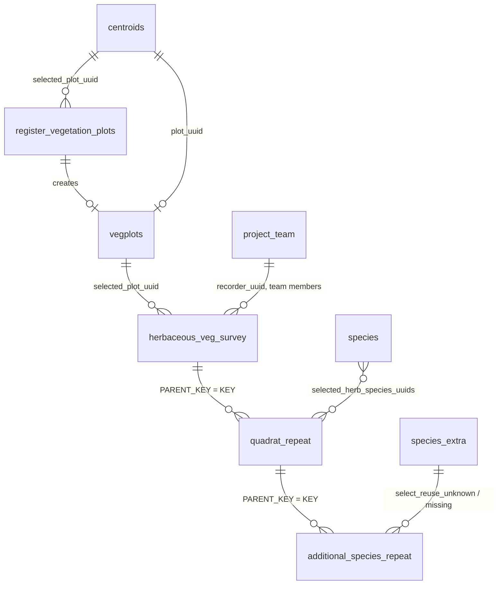

# Vegetation QA/QC: requirements for the Tech team

**Samantha Cohen**

## 1. Purpose

Automatically check each new batch of herbaceous vegetation survey data against the SOPs and the ODK forms, flag every problem, and show the results in a dashboard. The checks flag errors and never change or remove data. The working version is `vegetation_analysis.ipynb`, and its results are in `vegetation_analysis.md`. This note describes inputs, rules and outputs only, and leaves the platform open.

## 2. Inputs

Read these as received, on every run. The rules need the columns named in `vegetation_analysis.ipynb`.

| Input | Used for |
|---|---|
| ODK export `herbaceous_veg_survey` | One row per survey: plot, team, recorder, times, review state, photo counts |
| ODK export `quadrat_repeat` | One row per quadrat: number, species recorded, GPS point and accuracy |
| ODK export `additional_species_repeat` | Species not on the list: entry mode, typed name, photos |
| ODK export `register_vegetation_plots` | Plot registration: endpoints A and B, midpoint, accuracies, viability |
| Entity lists `vegplots`, `centroids` | Registered plots, planned points, stratum and status |
| Entity lists `species`, `species_extra`, `project_team` | Valid species, reused placeholder species, active team members |

`herbaceous_veg_survey` is the parent. `quadrat_repeat` and `additional_species_repeat` are repeats nested inside it, and the entity lists hold the definitions the forms use. The tables link as shown below. A row that does not link is a flag, not a reason to stop.

## 3. Checks

Priority: M = must, S = should, O = optional. The notebook gives the source of each rule (SOP section or form constraint).

| ID | Pri | Rule: flag when |
|---|---|---|
| 1 | M | A survey does not have exactly 20 quadrat rows, or the repeat count is not 20 |
| 2 | M | Quadrat numbers in a survey are not exactly 1 to 20 |
| 3 | M | The plot is not registered, not viable, or not in the selected survey |
| 4 | M | The same plot appears in more than one survey submission |
| 5 | S | The recorder is not in the selected team, or a team member is not active |
| 6 | S | A survey ends before it starts, or is submitted before it ends |
| 7 | O | Photos present are fewer than expected |
| 8 | M | A quadrat GPS accuracy is above the accuracy limit |
| 9 | S | A quadrat is too far from the plot midpoint, too far from the A to B line, or past either end |
| 10 | M | Species recorded contradict `herbs_present`, the species count, or `all_unknown_unidentifiable` |
| 11 | S | A species is not on the species list, or is not herbaceous |
| 12 | M | No quadrat in a survey has any species |
| 13 | M | `validated_name` is empty for an additional species |
| 14 | M | `new_missing_canonical` is not `Genus_species`, or has a leading or trailing space |
| 15 | S | A species typed as missing is already on the species list |
| 16 | S | A new unknown has no close-up photo, or a reused record is missing or not active |
| 17 | M | The registered midpoint is more than the move limit from the planned point |
| 18 | M | The A to B distance, or midpoint to either endpoint, is off its nominal length by more than the recorded accuracies added together |
| 19 | S | A registration GPS accuracy is above the accuracy limit |
| 20 | M | A non-viable plot has no reason, or has a survey |
| 21 | O | A surveyed plot has fire as a disturbance |
| 22 | M | Not a flag: compare planned, registered and surveyed plots (section 5) |
| 23 | O | Two quadrats in a survey have exactly the same coordinates |

Each limit below is a named setting, kept in one place and read by every check that uses it. No check contains the number itself. If Natural State confirms or replaces a limit, for example the 30 m quadrat-to-midpoint limit, the Tech team changes that one setting and leaves the checks as they are.

| Setting | Value | Source |
|---|---|---|
| Quadrats per survey | 20 | Herbaceous SOP section 3.1 |
| Transect length, midpoint to endpoint | 50 m, 25 m | Plot Registration SOP section 2, Figure 1 |
| GPS accuracy limit | 5 m | Herbaceous SOP section 4.2 |
| Midpoint move limit | 25 m | Plot Registration SOP section 5 step 5 |
| Quadrat to midpoint | 30 m | Derived (25 m plus 5 m GPS accuracy) |
| Quadrat to A to B line | 12 m | Derived (2 m plus 5 m for the quadrat plus 5 m for the line) |
| Quadrat past either end | 5 m | Derived (GPS accuracy) |
| Transect length tolerance | Sum of the two recorded accuracies | Derived |

## 4. Outputs

**Flags table**, one row per problem, and the same table on every run for the same input:

| Column | Meaning |
|---|---|
| `check_id` | The check number above |
| `table` | The table the flagged row is in |
| `key` | `KEY` of the flagged row |
| `detail` | Plain text, for example the measured distance and the limit |

Every flag must trace back to a row in the inputs. Flagged rows stay in the data.

## 5. Dashboard views

These are the four sections of the report, each recomputed from the inputs and the flags table:

1. **Survey summary:** submissions, plots, dates, quadrats received, review states, and flags per survey by priority.
2. **Plot summary:** planned, registered, viable and surveyed plots, transect length and accuracy, flags per plot.
3. **Sampling effort:** planned, registered, surveyed and not yet surveyed plots by stratum and status, and quadrats received against 20 per plot.
4. **Map:** every planned point, colored by status and shaded by the number of flags. A second view shows one plot's quadrats against its A to B line in meters.

## 6. Open questions

1. **Derived limits (checks 9 and 18).** The SOPs state none. Natural State should confirm or replace them. They depend on GPS error, so a flag means "review", not "wrong".
2. **Survey time limit (check 6).** The SOPs give none, so only the order of start, end and submission is checked.
3. **Rejected and repeated surveys.** Two plots were surveyed twice, and one submission of each is `rejected`. Should the dashboard exclude rejected submissions from the summaries?
4. **Species spelling.** The `species` entity list only holds species already on the project list. There is no taxonomy list for the extra species that field teams type in (`new_missing_canonical`), so check 14 tests the format only, not the spelling.
5. **Species name format.** The SOP requires an underscore, and every typed name in the sample uses a space. Should the form enforce the format?
