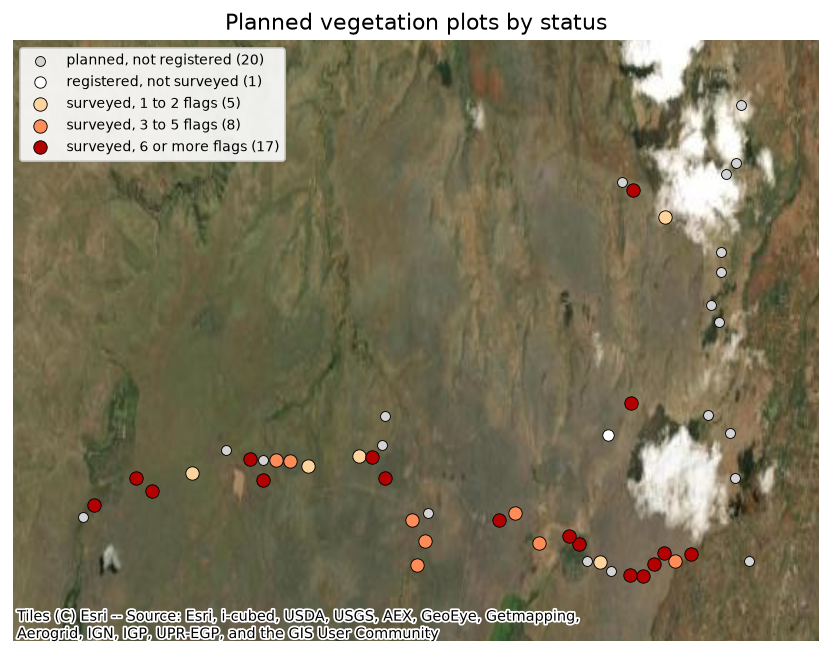
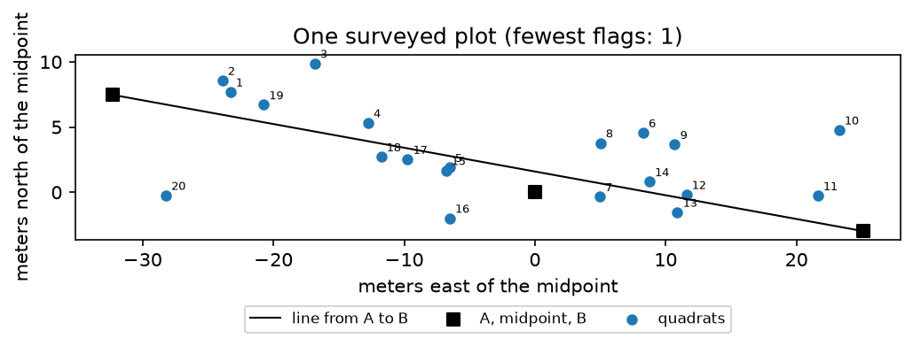

# NS Take-Home Assignment - Vegetation Challenge
**Samantha Cohen**

Output last computed on <!-- run-date -->2026-10-10<!-- /run-date -->.

## Contents

1. [Data and reference materials](#1-data-and-reference-materials)
2. [How the checks work](#2-how-the-checks-work)
3. [Survey-level summary](#3-survey-level-summary)
4. [Plot-level summary](#4-plot-level-summary)
5. [Sampling effort assessment](#5-sampling-effort-assessment)
6. [Map of transect locations](#6-map-of-transect-locations)
7. [What each flag means](#7-what-each-flag-means)

## 1. Data and reference materials

The ODK exports are the data to be checked. Everything else is reference material used to build the checks.

All numbers below come from `vegetation_analysis.ipynb`, which holds the code. Nothing in the data was changed or removed: errors are flagged, not fixed.

## 2. How the checks work

I planned 23 checks, each from a rule in the two SOPs (Herbaceous Vegetation Surveys and Vegetation Plot Registration), a constraint in the ODK forms, or the data itself. The notebook lists every check with its rule and source. Each problem found becomes one row in `flags_table` (`check_id`, `table`, `key`, `detail`).

Two checks use limits that I derived, because the SOPs give the layout but no tolerance for how far a GPS-measured location can deviate from it:

- **Check 9 (quadrat location).** A quadrat is flagged if it is more than 30 m from the plot midpoint, more than 12 m from the line between endpoints A and B, or more than 5 m past either end of that line. The limits come from the SOP geometry (a 50 m transect, with each quadrat covering 1.5 to 2.5 m from the line) plus the 5 m GPS accuracy the SOP asks for, counted for the quadrat and for both endpoints.
- **Check 18 (transect length).** The distance from A to B should be 50 m, and from the midpoint to each endpoint 25 m, within the two `-Accuracy` values recorded for the points involved added together.

Because these limits depend on GPS error, a flag from check 9 or 18 means "worth a second look", not "wrong".

## 3. Survey-level summary

| Metric | Value |
|---|---|
| Survey submissions (`herbaceous_veg_survey`) | 32 |
| Distinct plots surveyed | 30 |
| First and last survey start | 2026-05-19 and 2026-05-27 |
| Distinct recorders | 2 |
| Quadrat rows received (`quadrat_repeat`) | 640 |
| Surveys with all 20 quadrats | 32 of 32 |
| Quadrats with herbaceous species present | 633 of 640 (98.9%) |
| Surveys with species in fewer than 20 quadrats | 6 |
| Submissions with `ReviewState` = rejected | 2 |

Two plots were surveyed twice, so 4 submissions cover 2 plots. For each of those plots, one of the two submissions has `ReviewState` = rejected, so a reviewer has already set it aside.

All 32 surveys have at least one flag, but most of that comes from check 9. Of the 274 flags, 193 come from check 9, and only 7 surveys carry a flag from a check other than 9 and 14.

| Flags per survey | Surveys |
|---|---|
| 0 | 0 |
| 1 | 3 |
| 2 | 3 |
| 3 to 5 | 8 |
| 6 or more | 18 |

By check priority (M = must, S = should, O = optional, set in the notebook): 78 flags in 23 surveys for M checks, 194 flags in 31 surveys for S checks, and 2 flags in 1 survey for O checks.

## 4. Plot-level summary

| Metric | Value |
|---|---|
| Planned plots (`centroids`) | 51 (36 primary, 15 backup) |
| Registered plots (`register_vegetation_plots`) | 31 (30 primary, 1 backup) |
| Registered as viable / not viable | 30 / 1 |
| Plots surveyed | 30 (29 primary, 1 backup) |
| Plots with A, midpoint and B recorded | 30 |
| Transect length A to B (minimum, median, maximum) | 22.6 m, 49.1 m, 65.5 m |
| Registration GPS accuracy (median, maximum) | 3.8 m, 5.0 m |
| Plots visited more than once | 2 |
| Registered plots with a flag (checks 17 to 21) | 18 of 31 |
| Surveyed plots with at least one flag | 30 of 30 |

The registered transect lengths are the main plot-level finding. Measured A to B lengths range from 22.6 m to 65.5 m against a nominal 50 m. Check 18 flags 27 distances in 18 plots (9 for A to B, 10 for A to midpoint, 8 for midpoint to B) that differ from the nominal length by more than the recorded GPS accuracy allows. No registration point has an accuracy above 5 m.

## 5. Sampling effort assessment

| Stratum | Status | Planned | Registered | Surveyed | Not yet surveyed |
|---|---|---|---|---|---|
| savanna | primary | 30 | 30 | 29 | 1 |
| savanna | backup | 10 | 1 | 1 | 9 |
| shrubland | primary | 6 | 0 | 0 | 6 |
| shrubland | backup | 5 | 0 | 0 | 5 |
| **Total** | | **51** | **31** | **30** | **21** |

- **Savanna is nearly complete.** 29 of the 30 primary plots were surveyed. The one registered primary plot that was not surveyed is the plot registered as not viable.
- **Shrubland has not been sampled.** None of the 11 planned shrubland plots (6 primary, 5 backup) has been registered or surveyed. Any result from this data covers savanna only.
- **Quadrat effort matches the design.** 30 plots at 20 quadrats each is 600 quadrats. The 640 rows received include the 2 plots that were surveyed twice, and every survey has all 20 quadrats.
- **One backup plot was surveyed.** It was registered and surveyed while the non-viable primary plot stayed unsurveyed, which fits the Plot Registration SOP rule that a non-viable plot is replaced with a backup. The data do not state the link, so this is an inference.

## 6. Map of transect locations

The map shows every planned point on a satellite background (Esri World Imagery, with the attribution printed on the figure). At this scale a 50 m transect is a point, so each dot is one plot. Surveyed plots are shaded by the number of flags on their survey. Most of the plots that were planned but not registered (grey) are in the northeast.

The second figure shows the survey with the fewest flags: its 20 quadrat points against the line between endpoints A and B, in meters from the midpoint. The quadrats scatter several meters from the line, which is about the size of the GPS accuracy (up to 5 m). This is why check 9 uses a limit of 12 m across the line, and why a limit of 5 m would flag half of all quadrats.

## 7. What each flag means

Checks that flagged something:

| Check | What it flags | Flags | Records |
|---|---|---|---|
| 4 | The same plot appears in more than one survey submission (2 plots, 4 submissions). | 4 | 4 surveys |
| 9 | A quadrat is more than 30 m from the plot midpoint (52), more than 12 m from the A to B line (98), or more than 5 m past either end (43). Some quadrats trip more than one. | 193 | 147 quadrats in 31 surveys |
| 13 | `validated_name` is empty in `additional_species_repeat`. | 1 | 1 row |
| 14 | `new_missing_canonical` is not `Genus_species`. The SOP requires an underscore (Herbaceous SOP sections 2 and 5), and every typed name uses a space. The form does not enforce the format. Spelling is not checked. | 45 | 45 rows in 20 surveys |
| 15 | A species typed as missing (`new_missing_canonical`) is already on the species list. | 1 | 1 row |
| 17 | The registered midpoint is more than 25 m from the planned point (33.5 m). The Plot Registration SOP says the midpoint cannot move more than 25 m. | 1 | 1 plot |
| 18 | A transect distance (A to B, A to midpoint, midpoint to B) differs from its nominal length by more than the recorded accuracies added together. | 27 | 18 plots |
| 23 | Two quadrats of the same survey have exactly the same coordinates. | 2 | 2 quadrats in 1 survey |

Checks that found nothing: 1 and 2 (20 quadrats, numbered 1 to 20), 3 (plot registered, viable and in the herbaceous survey), 5 (recorder and team valid), 6 (timing order), 7 (missing photos), 8 and 19 (GPS accuracy of 5 m or better), 10 (species logic within a quadrat), 11 (species valid and herbaceous), 12 (plots with no species), 16 (photos and reused records), 20 (non-viable plots), and 21 (fire on a surveyed plot). Several of these are enforced by the ODK forms, so zero flags shows the forms are working, not that the check is broken. Check 22 (planned, registered, surveyed) is a comparison and is reported in sections 4 and 5.

Limits of this report:

- Check 6 tests order only. The SOPs give no time limit for a survey, so none is checked.
- Species names are checked for format, not for correct spelling, because there is no taxonomy list to check against.
- GPS-based limits (checks 9 and 18) cannot tell a misplaced quadrat from a noisy fix with 5 m accuracy, so those flags need a field review.
